# Opquast — présentation Miweb 2026 : prompts et notes

<!-- PDG-LARGE-FILE-JUSTIFICATION: archive des 44 consignes et notes du PPTX dans leur ordre, conservée en un document pour la traçabilité. -->

Archive de préparation. Le tarif de la slide 44 est corrigé dans le texte du site ; les notes historiques ci-dessous sont conservées telles qu’extraites.

Les **44 slides** suivent exactement l’ordre du `opquast-presentation-miweb-2026.pptx` (empreinte et correspondances dans [la provenance](provenance.json)). Chaque entrée contient le visuel sélectionné, ses consignes de conception conservées et les notes du présentateur extraites de ce PPTX.

**Limite sur les prompts :** les six fichiers `imagegen-prompts-export.txt` signalent `NOT VERIFIED`. Ils ne contiennent pas le texte intégral des appels au générateur. Les caches et sessions référencés dans les reçus ne sont plus présents sur cette machine. Les blocs « Prompt disponible » ci-dessous réunissent donc le masque commun et le contrat de la slide, copiés du storyboard source. **Ce sont les consignes documentées, pas des prompts originaux attestés.** Les éventuelles reprises de génération ne peuvent pas être reconstituées intégralement.

Les notes proviennent uniquement du PowerPoint sélectionné, et non des anciens fichiers `notes-orateur.md`. Leur texte et leurs sauts de ligne sont conservés, hors paragraphes vides au début et à la fin. Les numéros et pieds de page techniques des pages de notes sont exclus. Leur contenu est reproduit sans correction ni actualisation.

L’ordre provient de `ppt/presentation.xml` et de ses relations. Pour chaque slide, les dimensions et l’intégralité des pixels RGBA du PNG source correspondent à l’image incorporée. Quand plusieurs séries réutilisent la même image, la première série source est retenue. Les numéros d’origine sont indiqués pour éviter de les confondre avec l’ordre du PPTX.

Extraction : 8 septembre 2026. Empreinte SHA-256 du PPTX lu :

`87714cf6f419ec24981f4ea0b1d74319013ebf2980ce9d1495c81b1c10a17d46`

## Sommaire

- [Slide 01 — Opquast, la qualité web qui se vérifie](#slide-01)
- [Slide 02 — V4 vers V5 : le référentiel se met à jour](#slide-02)
- [Slide 03 — Chacun fait bien son travail, et le site reste médiocre](#slide-03)
- [Slide 04 — Ce qu'on croit déjà couvrir](#slide-04)
- [Slide 05 — Opquast, ce que c'est et ce que ce n'est pas](#slide-05)
- [Slide 06 — Les 14 rubriques, par volume](#slide-06)
- [Slide 07 — Le référentiel est déjà un outil de pilotage](#slide-07)
- [Slide 08 — Les 6 dimensions transversales](#slide-08)
- [Slide 09 — Trois moments, trois métiers](#slide-09)
- [Slide 10 — Je veux une balançoire](#slide-10)
- [Slide 11 — Je veux une balançoire](#slide-11)
- [Slide 12 — Qualité : une attention constante](#slide-12)
- [Slide 13 — Les utilisateurs formulent cinq exigences](#slide-13)
- [Slide 14 — Les cinq dimensions de VPTCS](#slide-14)
- [Slide 15 — Moyen mnémotechnique](#slide-15)
- [Slide 16 — Différencier expérience utilisateur et interface utilisateur](#slide-16)
- [Slide 17 — UI est visible, UX traverse le parcours](#slide-17)
- [Slide 18 — VPTCS, le modèle derrière les règles](#slide-18)
- [Slide 19 — À chaque dimension ses métiers](#slide-19)
- [Slide 20 — La transversalité relie les métiers](#slide-20)
- [Slide 21 — (se) répartir les responsabilités](#slide-21)
- [Slide 22 — Un modèle sert à agir](#slide-22)
- [Slide 23 — Mettre en évidence la valeur ajoutée du site](#slide-23)
- [Slide 24 — L'utilisateur ne voit pas nos silos](#slide-24)
- [Slide 25 — Pour l’utilisateur, tout devient un seul service](#slide-25)
- [Slide 26 — Les silos organisent des décisions différentes](#slide-26)
- [Slide 27 — Les cinq domaines de QSE-IP](#slide-27)
- [Slide 28 — Auditer ou évaluer un site](#slide-28)
- [Slide 29 — VPTCS dépasse le numérique](#slide-29)
- [Slide 30 — Une règle a quatre éléments](#slide-30)
- [Slide 31 — Une règle commence par un problème utilisateur](#slide-31)
- [Slide 32 — Une règle pose une seule question](#slide-32)
- [Slide 33 — Une règle doit rester claire et applicable](#slide-33)
- [Slide 34 — Une règle doit durer et rassembler](#slide-34)
- [Slide 35 — Une règle passe cinq questions](#slide-35)
- [Slide 36 — La règle se construit à plusieurs](#slide-36)
- [Slide 37 — Règle 69, l'étiquette de formulaire](#slide-37)
- [Slide 38 — Règle 165, le focus clavier](#slide-38)
- [Slide 39 — La certification, ce qu'elle est](#slide-39)
- [Slide 40 — La formation, 12 à 14 heures en ligne](#slide-40)
- [Slide 41 — Les trois conditions pour accéder à l'examen](#slide-41)
- [Slide 42 — Le jour de l'examen](#slide-42)
- [Slide 43 — Après l'examen](#slide-43)
- [Slide 44 — Ce que cela représente](#slide-44)

---

<a id="slide-01"></a>

## Slide 01 — Opquast, la qualité web qui se vérifie

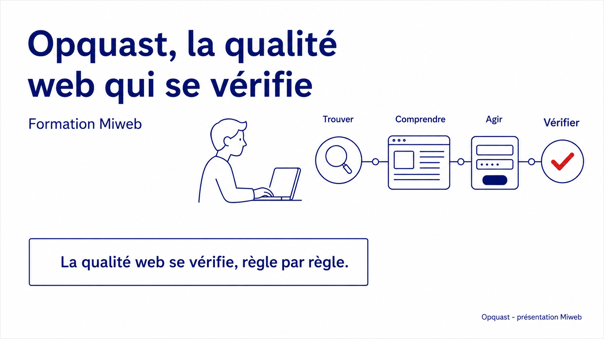

Origine : [2026-09-04-opquast-formation-miweb, slide 01](../assets/slides/slide-01.png). Correspondance vérifiée : fichier PNG identique.

### Prompt disponible

Consignes conservées dans le [storyboard source](origines/2026-09-04-opquast-formation-miweb/storyboard-pds.md), section de la slide 01 (ligne 31). L’[export des prompts](origines/2026-09-04-opquast-formation-miweb/imagegen-prompts-export.txt) ne permet pas de retrouver l’appel original exact.

```text
MASQUE COMMUN — extrait du storyboard

- Format : image finale 16:9, 1600 x 900 px.
- Fond : blanc.
- Structure : bleu nuit institutionnel `#001070`, panneaux gris froid `#F2F3F7`, rouge de contrôle `#E44850` uniquement pour un risque, une alerte ou un point à confirmer.
- Typographie visible : Marianne ; Arial seulement comme fallback explicite.
- Titre : haut gauche, casse de phrase, sans numéro visible.
- Footer : `Opquast - présentation Miweb`, discret en bas à droite.
- Formes : scènes concrètes, objets-systèmes, diagrammes plats, traits fins, flèches logiques, aucun faux logo ou emblème.
- Callout : phrase courte, stable en bas, bleu ou gris froid, jamais rouge.

CONTRAT DE LA SLIDE SOURCE 01 — Opquast, la qualité web qui se vérifie

- Étape : ouverture et promesse de la présentation.
- Idée principale : la qualité web devient vérifiable règle par règle.
- Idée observable : une personne suit un service web depuis la recherche jusqu'à l'action, avec trois points de contrôle.
- Forme visuelle : couverture avec métaphore concrète.
- Visuel seul : un service web passe par `Trouver`, `Comprendre`, `Agir` et aboutit à une checklist contrôlée.
- Libellés : `Trouver`, `Comprendre`, `Agir`, `Vérifier`.
- Phrase à retenir : `La qualité web se vérifie, règle par règle.`
- Ajout : annonce le sujet.
- Prépare : le vécu des défauts entre les métiers.
- Contraintes critiques : titre exact ; aucun logo officiel ; footer exact.
```

### Notes du présentateur

```text
Présenter le sujet
Annoncer 45 minutes 
```

Source : `ppt/notesSlides/notesSlide1.xml`, lié à la slide 01 dans le PPTX fourni.

---

<a id="slide-02"></a>

## Slide 02 — V4 vers V5 : le référentiel se met à jour

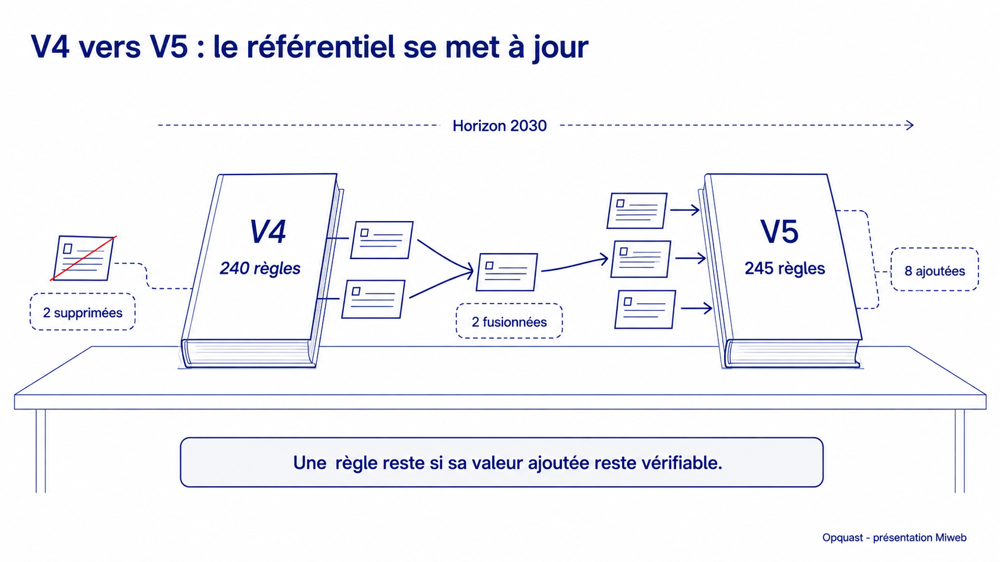

Origine : [Critères de fabrication des règles, slide 42](../assets/slides/slide-02.png). Correspondance vérifiée : fichier PNG identique.

### Prompt disponible

Consignes conservées dans le [storyboard source](origines/2026-09-05-opquast-formation-criteres-regles-prolongation/storyboard-pds.md), section de la slide 42 (ligne 138). L’[export des prompts](origines/2026-09-05-opquast-formation-criteres-regles-prolongation/imagegen-prompts-export.txt) ne permet pas de retrouver l’appel original exact.

```text
MASQUE COMMUN — extrait du storyboard

- Format : image finale 16:9, nouvelles slides en 1672 × 941 px, puis PPTX
  plein écran 16:9 ; la slide 27 héritée mesure 1673 × 940 px.
- Fond blanc, bleu profond `#001070`, panneaux gris très clair `#F2F3F7`.
- Rouge `#E44850` uniquement pour une réserve ou une condition à éviter.
- Typographie visible : Marianne, Arial comme fallback explicite.
- Titre en haut à gauche, sans numéro visible.
- Trois à cinq labels courts par slide, une seule tension ou transformation.
- Callout centré en bas, bleu ou gris, jamais rouge.
- Pied de page exact : `Opquast - présentation Miweb`.
- Aucun logo inventé, blason, photo, dégradé, 3D, effet décoratif ou texte
  parasite.

CONTRAT DE LA SLIDE SOURCE 42 — V4 vers V5 : le référentiel se met à jour

- Scène : deux éditions d’un référentiel sont posées sur une table de revue ;
  certaines fiches sortent, d’autres fusionnent et de nouvelles entrent.
- Transformation : V4 `240 règles` → V5 `245 règles`.
- Texte exact : `2 supprimées`, `2 fusionnées`, `8 ajoutées`, `Horizon 2030`.
- Callout : `Une règle reste si sa valeur ajoutée reste vérifiable.`
- Ce que l’image seule doit montrer : la durabilité autorise la révision, pas la
  conservation automatique.
- Contraintes critiques : chiffres exacts ; ne pas présenter la liste des huit
  règles ajoutées comme exhaustive à l’écran ; ne pas transformer SMART en
  doctrine officielle.
```

### Notes du présentateur

```text
La durabilité ne signifie pas la conservation automatique. 

L’atelier V5 demande notamment si une règle restera valable jusqu’à l’horizon 2030. 

Les règles peuvent donc être retirées lorsqu’elles ont perdu leur valeur ajoutée, regroupées si elles sont redondantes, ou ajoutées lorsqu’un besoin précis le justifie.

SMART
spécificité,
mesurabilité reproductible, 
faisabilité, 
pertinence et durabilité. 
```

Source : `ppt/notesSlides/notesSlide2.xml`, lié à la slide 02 dans le PPTX fourni.

---

<a id="slide-03"></a>

## Slide 03 — Chacun fait bien son travail, et le site reste médiocre


Origine : [2026-09-04-opquast-formation-miweb, slide 02](../assets/slides/slide-03.png). Correspondance vérifiée : fichier PNG identique.

### Prompt disponible

Consignes conservées dans le [storyboard source](origines/2026-09-04-opquast-formation-miweb/storyboard-pds.md), section de la slide 02 (ligne 43). L’[export des prompts](origines/2026-09-04-opquast-formation-miweb/imagegen-prompts-export.txt) ne permet pas de retrouver l’appel original exact.

```text
MASQUE COMMUN — extrait du storyboard

- Format : image finale 16:9, 1600 x 900 px.
- Fond : blanc.
- Structure : bleu nuit institutionnel `#001070`, panneaux gris froid `#F2F3F7`, rouge de contrôle `#E44850` uniquement pour un risque, une alerte ou un point à confirmer.
- Typographie visible : Marianne ; Arial seulement comme fallback explicite.
- Titre : haut gauche, casse de phrase, sans numéro visible.
- Footer : `Opquast - présentation Miweb`, discret en bas à droite.
- Formes : scènes concrètes, objets-systèmes, diagrammes plats, traits fins, flèches logiques, aucun faux logo ou emblème.
- Callout : phrase courte, stable en bas, bleu ou gris froid, jamais rouge.

CONTRAT DE LA SLIDE SOURCE 02 — Chacun fait bien son travail, et le site reste médiocre

- Étape : problème vécu.
- Idée principale : les défauts passent entre les périmètres métiers.
- Idée observable : trois professionnels livrent chacun une pièce correcte, mais l'utilisateur reçoit un formulaire incompréhensible et une information introuvable.
- Forme visuelle : comparaison avant / expérience utilisateur.
- Visuel seul : trois flux séparés convergent vers une expérience cassée.
- Libellés : `Développeur`, `Designer`, `Rédacteur`, `Utilisateur`.
- Phrase à retenir : `La qualité tombe entre les périmètres.`
- Ajout : concrétise le problème.
- Prépare : les filets qui semblent déjà couvrir la qualité.
- Contraintes critiques : ne pas présenter les métiers comme incompétents ; montrer le défaut de raccordement.
```

### Notes du présentateur

```text
Le développeur livre du code propre. 
Le designer livre des maquettes soignées. 
Le rédacteur livre des textes justes.
Et pourtant l'utilisateur ne trouve pas le numéro de téléphone, le formulaire refuse sa saisie sans dire pourquoi, la page se lit mal sur son téléphone.

La qualité web ne tombe dans le périmètre de personne en particulier. 
Elle tombe entre les périmètres.

Demander à main levée qui a déjà vu un formulaire rejeter une saisie sans expliquer pourquoi.
```

Source : `ppt/notesSlides/notesSlide3.xml`, lié à la slide 03 dans le PPTX fourni.

---

<a id="slide-04"></a>

## Slide 04 — Ce qu'on croit déjà couvrir

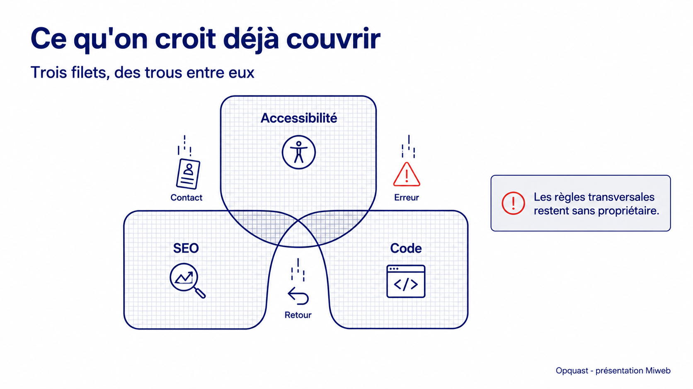

Origine : [2026-09-04-opquast-formation-miweb, slide 03](../assets/slides/slide-04.png). Correspondance vérifiée : fichier PNG identique.

### Prompt disponible

Consignes conservées dans le [storyboard source](origines/2026-09-04-opquast-formation-miweb/storyboard-pds.md), section de la slide 03 (ligne 55). L’[export des prompts](origines/2026-09-04-opquast-formation-miweb/imagegen-prompts-export.txt) ne permet pas de retrouver l’appel original exact.

```text
MASQUE COMMUN — extrait du storyboard

- Format : image finale 16:9, 1600 x 900 px.
- Fond : blanc.
- Structure : bleu nuit institutionnel `#001070`, panneaux gris froid `#F2F3F7`, rouge de contrôle `#E44850` uniquement pour un risque, une alerte ou un point à confirmer.
- Typographie visible : Marianne ; Arial seulement comme fallback explicite.
- Titre : haut gauche, casse de phrase, sans numéro visible.
- Footer : `Opquast - présentation Miweb`, discret en bas à droite.
- Formes : scènes concrètes, objets-systèmes, diagrammes plats, traits fins, flèches logiques, aucun faux logo ou emblème.
- Callout : phrase courte, stable en bas, bleu ou gris froid, jamais rouge.

CONTRAT DE LA SLIDE SOURCE 03 — Ce qu'on croit déjà couvrir

- Étape : limites des pratiques existantes.
- Idée principale : les audits et revues existants laissent des trous entre eux.
- Idée observable : trois filets nommés `Accessibilité`, `SEO`, `Code` laissent tomber `Contact`, `Erreur`, `Retour`.
- Forme visuelle : mécanisme avec trous visibles.
- Visuel seul : des éléments concrets passent entre les filets.
- Libellés : `Accessibilité`, `SEO`, `Code`, `Contact`, `Erreur`, `Retour`.
- Phrase à retenir : `Les règles transversales restent sans propriétaire.`
- Ajout : montre pourquoi un référentiel transversal est nécessaire.
- Prépare : la définition et les limites d'Opquast.
- Contraintes critiques : rappeler que les trois pratiques restent utiles ; ne pas les disqualifier.
```

### Notes du présentateur

```text
Une équipe outillée a souvent trois filets : 

 un audit d'accessibilité, souvent ponctuel et souvent en fin de projet ; 
 des bonnes pratiques de référencement, portées par un seul métier ; 
 une revue de code, qui regarde la forme du code plus que l'usage.

Ces filets se recouvrent mal.  Entre eux passent les règles qui n'appartiennent à aucun métier : 

l'adresse de contact joignable, 
la politique de retour lisible 
et le message d'erreur compréhensible.

Préciser que ces pratiques ne sont pas mauvaises, mais qu'elles laissent des trous.
```

Source : `ppt/notesSlides/notesSlide4.xml`, lié à la slide 04 dans le PPTX fourni.

---

<a id="slide-05"></a>

## Slide 05 — Opquast, ce que c'est et ce que ce n'est pas

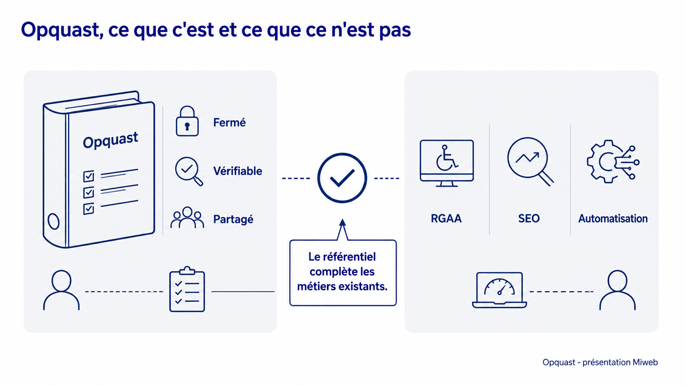

Origine : [2026-09-04-opquast-formation-miweb, slide 04](../assets/slides/slide-05.png). Correspondance vérifiée : fichier PNG identique.

### Prompt disponible

Consignes conservées dans le [storyboard source](origines/2026-09-04-opquast-formation-miweb/storyboard-pds.md), section de la slide 04 (ligne 67). L’[export des prompts](origines/2026-09-04-opquast-formation-miweb/imagegen-prompts-export.txt) ne permet pas de retrouver l’appel original exact.

```text
MASQUE COMMUN — extrait du storyboard

- Format : image finale 16:9, 1600 x 900 px.
- Fond : blanc.
- Structure : bleu nuit institutionnel `#001070`, panneaux gris froid `#F2F3F7`, rouge de contrôle `#E44850` uniquement pour un risque, une alerte ou un point à confirmer.
- Typographie visible : Marianne ; Arial seulement comme fallback explicite.
- Titre : haut gauche, casse de phrase, sans numéro visible.
- Footer : `Opquast - présentation Miweb`, discret en bas à droite.
- Formes : scènes concrètes, objets-systèmes, diagrammes plats, traits fins, flèches logiques, aucun faux logo ou emblème.
- Callout : phrase courte, stable en bas, bleu ou gris froid, jamais rouge.

CONTRAT DE LA SLIDE SOURCE 04 — Opquast, ce que c'est et ce que ce n'est pas

- Étape : positionnement.
- Idée principale : Opquast est une liste fermée de règles vérifiables et partagées, complémentaire des autres référentiels.
- Idée observable : un classeur fermé et vérifiable est séparé de trois objets barrés : RGAA, SEO, audit automatique.
- Forme visuelle : architecture en deux périmètres.
- Visuel seul : le périmètre Opquast est clair, les confusions sont écartées.
- Libellés : `Fermé`, `Vérifiable`, `Partagé`, `RGAA`, `SEO`, `Automatisation`.
- Phrase à retenir : `Le référentiel complète les métiers existants.`
- Ajout : définit le périmètre.
- Prépare : les chiffres du référentiel.
- Contraintes critiques : ne pas dire qu'Opquast remplace le RGAA ; montrer que certaines règles demandent un contrôle humain.
```

### Notes du présentateur

```text
Opquast est une liste fermée de règles de qualité web, vérifiables une par une, opposables et partagées par tous les métiers qui fabriquent un site. 

Le référentiel compte 245 règles, réparties en 14 rubriques et traversées par 6 dimensions.

Le nom signifie « Open Quality Standards ». 

Les premières listes datent de 2004 et la liste principale est révisée tous les cinq ans.

Opquast n'est pas un référentiel d'accessibilité : le RGAA reste la référence réglementaire. 
Ce n'est pas une méthode de référencement. 
Ce n'est pas un audit automatisé, car une partie des règles se vérifie à la main.

À dire :

Appuyer sur trois mots : fermée, vérifiable, partagée. 
« Fermée » veut dire qu'on sait quand on a fini. 

Anticiper la question : « On fait déjà du RGAA, à quoi bon ? » 
Les deux se complètent et leur recouvrement est partiel.
```

Source : `ppt/notesSlides/notesSlide5.xml`, lié à la slide 05 dans le PPTX fourni.

---

<a id="slide-06"></a>

## Slide 06 — Les 14 rubriques, par volume

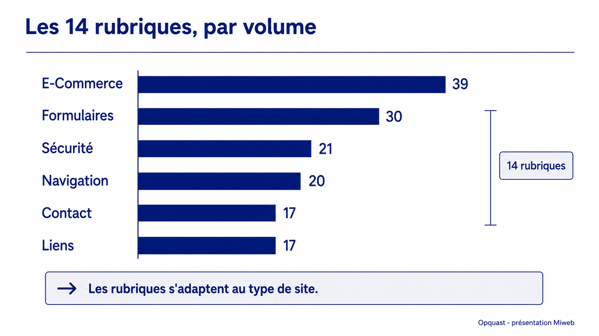

Origine : [2026-09-04-opquast-formation-miweb, slide 06](../assets/slides/slide-06.png). Correspondance vérifiée : fichier PNG identique.

### Prompt disponible

Consignes conservées dans le [storyboard source](origines/2026-09-04-opquast-formation-miweb/storyboard-pds.md), section de la slide 06 (ligne 91). L’[export des prompts](origines/2026-09-04-opquast-formation-miweb/imagegen-prompts-export.txt) ne permet pas de retrouver l’appel original exact.

```text
MASQUE COMMUN — extrait du storyboard

- Format : image finale 16:9, 1600 x 900 px.
- Fond : blanc.
- Structure : bleu nuit institutionnel `#001070`, panneaux gris froid `#F2F3F7`, rouge de contrôle `#E44850` uniquement pour un risque, une alerte ou un point à confirmer.
- Typographie visible : Marianne ; Arial seulement comme fallback explicite.
- Titre : haut gauche, casse de phrase, sans numéro visible.
- Footer : `Opquast - présentation Miweb`, discret en bas à droite.
- Formes : scènes concrètes, objets-systèmes, diagrammes plats, traits fins, flèches logiques, aucun faux logo ou emblème.
- Callout : phrase courte, stable en bas, bleu ou gris froid, jamais rouge.

CONTRAT DE LA SLIDE SOURCE 06 — Les 14 rubriques, par volume

- Étape : structure du référentiel.
- Idée principale : les rubriques n'ont pas le même poids et dépendent du type de site.
- Idée observable : quatorze barres horizontales classées par volume, avec `E-Commerce 39` et `Formulaires 30` en tête.
- Forme visuelle : comparaison quantitative.
- Visuel seul : les volumes sont très inégaux.
- Libellés visibles : `E-Commerce 39`, `Formulaires 30`, `Sécurité 21`, `Navigation 20`, `Contact 17`, `Liens 17`.
- Phrase à retenir : `Les rubriques s'adaptent au type de site.`
- Ajout : passe du total à la composition.
- Prépare : les dimensions transversales.
- Contraintes critiques : les notes conservent la liste complète : Identification et contact 17 ; Présentation 17 ; Données personnelles 15 ; Structure et code 15 ; Contenus 14 ; Serveur et performances 13 ; Images et médias 12 ; Internationalisation 8 ; Newsletter 7.
```

### Notes du présentateur

```text
- E-Commerce : 39 règles
- Formulaires : 30
- Sécurité : 21
- Navigation : 20
- Identification et contact : 17
- Liens : 17
- Présentation : 17
- Données personnelles : 15
- Structure et code : 15
- Contenus : 14
- Serveur et performances : 13
- Images et médias : 12
- Internationalisation : 8
- Newsletter : 7


Ne pas lire la liste. Montrer puis commenter deux lignes. Les rubriques ne s'appliquent pas toutes à tous les sites : un site vitrine écarte d'emblée les 39 règles E-Commerce.
```

Source : `ppt/notesSlides/notesSlide6.xml`, lié à la slide 06 dans le PPTX fourni.

---

<a id="slide-07"></a>

## Slide 07 — Le référentiel est déjà un outil de pilotage

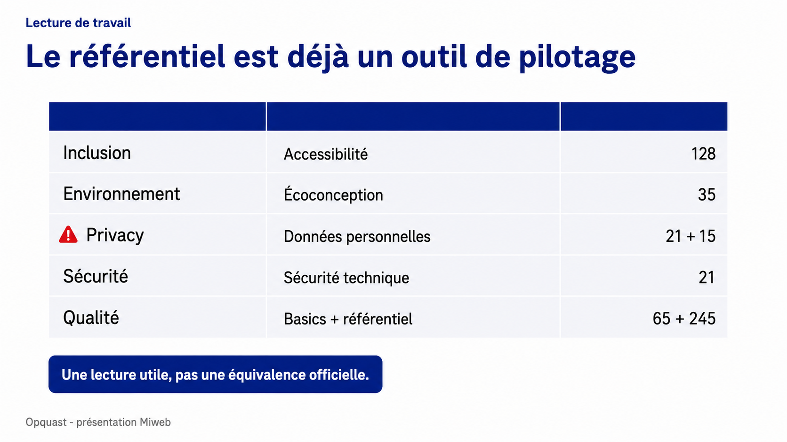

Origine : [2026-09-04-opquast-formation-miweb, slide 20](../assets/slides/slide-07.png). Correspondance vérifiée : fichier PNG identique.

### Prompt disponible

Consignes conservées dans le [storyboard source](origines/2026-09-04-opquast-formation-miweb/storyboard-pds.md), section de la slide 20 (ligne 259). L’[export des prompts](origines/2026-09-04-opquast-formation-miweb/imagegen-prompts-export.txt) ne permet pas de retrouver l’appel original exact.

```text
MASQUE COMMUN — extrait du storyboard

- Format : image finale 16:9, 1600 x 900 px.
- Fond : blanc.
- Structure : bleu nuit institutionnel `#001070`, panneaux gris froid `#F2F3F7`, rouge de contrôle `#E44850` uniquement pour un risque, une alerte ou un point à confirmer.
- Typographie visible : Marianne ; Arial seulement comme fallback explicite.
- Titre : haut gauche, casse de phrase, sans numéro visible.
- Footer : `Opquast - présentation Miweb`, discret en bas à droite.
- Formes : scènes concrètes, objets-systèmes, diagrammes plats, traits fins, flèches logiques, aucun faux logo ou emblème.
- Callout : phrase courte, stable en bas, bleu ou gris froid, jamais rouge.

CONTRAT DE LA SLIDE SOURCE 20 — Le référentiel est déjà un outil de pilotage

- Étape : rapprochement avec les preuves existantes.
- Idée principale : le référentiel offre déjà des règles vérifiables qui peuvent nourrir les cinq domaines.
- Idée observable : une matrice relie cinq domaines QSE-IP à des dimensions ou rubriques Opquast chiffrées.
- Forme visuelle : matrice de correspondance.
- Visuel seul : les intentions de pilotage rencontrent des points de contrôle concrets.
- Libellés : `Inclusion 128`, `Environnement 35`, `Privacy 21 + 15`, `Sécurité 21`, `Qualité 65 + 245`.
- Phrase à retenir : `Une lecture utile, pas une équivalence officielle.`
- Ajout : conclut la partie pilotage.
- Prépare : la certification des personnes.
- Contraintes critiques : signaler explicitement que ce rapprochement est une lecture et non une présentation officielle d'Opquast.
```

### Notes du présentateur

```text
Rapprochement des cinq domaines et des dimensions du référentiel, telles que mesurées dans la version V5.

- Inclusion : 128 règles portent la dimension Accessibilité.
- Environnement : 35 règles portent la dimension Écoconception.
- Privacy : 21 règles, plus la rubrique Données personnelles avec 15 règles.
- Sécurité : la rubrique dédiée compte 21 règles.
- Qualité : les 65 règles de la dimension Basics, et le référentiel dans son ensemble.

 Ce qu'il faut en retenir : les cinq domaines sont déjà adossés à des règles vérifiables.
```

Source : `ppt/notesSlides/notesSlide7.xml`, lié à la slide 07 dans le PPTX fourni.

---

<a id="slide-08"></a>

## Slide 08 — Les 6 dimensions transversales

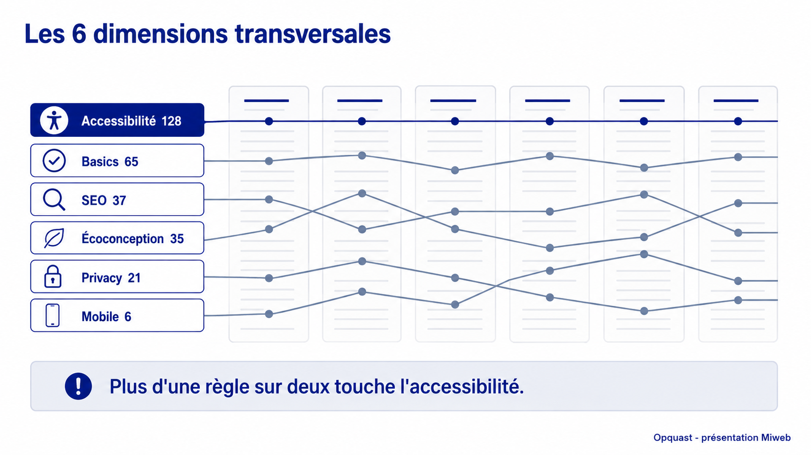

Origine : [2026-09-04-opquast-formation-miweb, slide 07](../assets/slides/slide-08.png). Correspondance vérifiée : fichier PNG identique.

### Prompt disponible

Consignes conservées dans le [storyboard source](origines/2026-09-04-opquast-formation-miweb/storyboard-pds.md), section de la slide 07 (ligne 103). L’[export des prompts](origines/2026-09-04-opquast-formation-miweb/imagegen-prompts-export.txt) ne permet pas de retrouver l’appel original exact.

```text
MASQUE COMMUN — extrait du storyboard

- Format : image finale 16:9, 1600 x 900 px.
- Fond : blanc.
- Structure : bleu nuit institutionnel `#001070`, panneaux gris froid `#F2F3F7`, rouge de contrôle `#E44850` uniquement pour un risque, une alerte ou un point à confirmer.
- Typographie visible : Marianne ; Arial seulement comme fallback explicite.
- Titre : haut gauche, casse de phrase, sans numéro visible.
- Footer : `Opquast - présentation Miweb`, discret en bas à droite.
- Formes : scènes concrètes, objets-systèmes, diagrammes plats, traits fins, flèches logiques, aucun faux logo ou emblème.
- Callout : phrase courte, stable en bas, bleu ou gris froid, jamais rouge.

CONTRAT DE LA SLIDE SOURCE 07 — Les 6 dimensions transversales

- Étape : lecture croisée.
- Idée principale : une règle appartient à une rubrique mais peut servir plusieurs dimensions.
- Idée observable : six fils colorés traversent un même ensemble de règles, avec `Accessibilité 128` mis en évidence.
- Forme visuelle : carte de connexions.
- Visuel seul : les dimensions traversent les rubriques.
- Libellés : `Accessibilité 128`, `Basics 65`, `SEO 37`, `Écoconception 35`, `Privacy 21`, `Mobile 6`.
- Phrase à retenir : `Plus d'une règle sur deux touche l'accessibilité.`
- Ajout : montre la transversalité.
- Prépare : les phases de fabrication.
- Contraintes critiques : garder les six valeurs exactes ; ne pas confondre dimension et rubrique.
```

### Notes du présentateur

```text
Une règle appartient à une rubrique, mais elle peut porter plusieurs dimensions.

- Accessibilité : 128 règles
- SEO : 37
- Écoconception : 35
- Privacy : 21
- Mobile : 6

Le chiffre qui parle à Miweb : 128 règles sur 245 touchent l'accessibilité, soit plus de la moitié du référentiel. 
```

Source : `ppt/notesSlides/notesSlide8.xml`, lié à la slide 08 dans le PPTX fourni.

---

<a id="slide-09"></a>

## Slide 09 — Trois moments, trois métiers

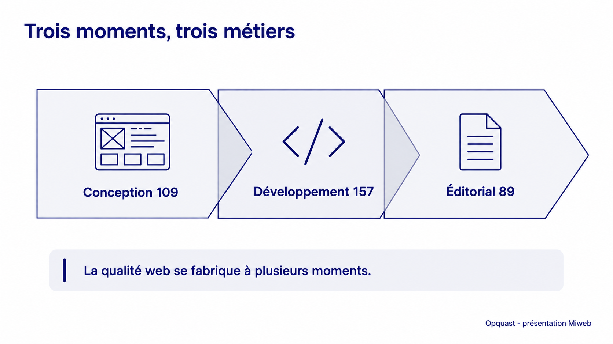

Origine : [2026-09-04-opquast-formation-miweb, slide 08](../assets/slides/slide-09.png). Correspondance vérifiée : fichier PNG identique.

### Prompt disponible

Consignes conservées dans le [storyboard source](origines/2026-09-04-opquast-formation-miweb/storyboard-pds.md), section de la slide 08 (ligne 115). L’[export des prompts](origines/2026-09-04-opquast-formation-miweb/imagegen-prompts-export.txt) ne permet pas de retrouver l’appel original exact.

```text
MASQUE COMMUN — extrait du storyboard

- Format : image finale 16:9, 1600 x 900 px.
- Fond : blanc.
- Structure : bleu nuit institutionnel `#001070`, panneaux gris froid `#F2F3F7`, rouge de contrôle `#E44850` uniquement pour un risque, une alerte ou un point à confirmer.
- Typographie visible : Marianne ; Arial seulement comme fallback explicite.
- Titre : haut gauche, casse de phrase, sans numéro visible.
- Footer : `Opquast - présentation Miweb`, discret en bas à droite.
- Formes : scènes concrètes, objets-systèmes, diagrammes plats, traits fins, flèches logiques, aucun faux logo ou emblème.
- Callout : phrase courte, stable en bas, bleu ou gris froid, jamais rouge.

CONTRAT DE LA SLIDE SOURCE 08 — Trois moments, trois métiers

- Étape : fabrication collective.
- Idée principale : les règles se répartissent sur plusieurs phases et métiers.
- Idée observable : une timeline chevauchée `Conception`, `Développement`, `Éditorial`, avec les volumes associés.
- Forme visuelle : chronologie avec recouvrement.
- Visuel seul : la qualité se construit à plusieurs moments.
- Libellés : `Développement 157`, `Conception 109`, `Éditorial 89`.
- Phrase à retenir : `La qualité web se fabrique à plusieurs moments.`
- Ajout : relie les règles aux équipes.
- Prépare : l'anatomie vérifiable d'une règle.
- Contraintes critiques : expliquer dans les notes que le total dépasse 245 car une règle peut relever de plusieurs phases.
```

### Notes du présentateur

```text
Chaque règle est rattachée à une ou plusieurs phases de fabrication.

- Développement : 157 règles
- Conception : 109 règles
- Éditorial : 89 règles

Une même règle relève souvent de plusieurs phases. 

 Les 89 règles éditoriales montrent que la qualité web n'est pas un sujet de développeurs uniquement.
```

Source : `ppt/notesSlides/notesSlide9.xml`, lié à la slide 09 dans le PPTX fourni.

---

<a id="slide-10"></a>

## Slide 10 — Je veux une balançoire

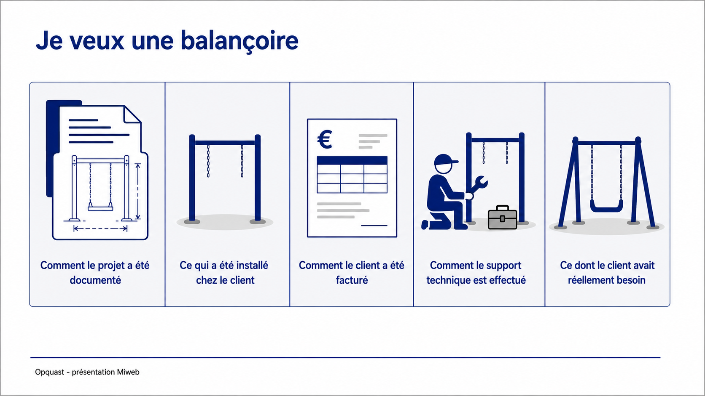

Origine : [2026-09-04-opquast-formation-captures-prolongation, slide 31](../assets/slides/slide-10.png). Correspondance vérifiée : fichier PNG identique.

### Prompt disponible

Consignes conservées dans le [storyboard source](origines/2026-09-04-opquast-formation-captures-prolongation/storyboard-pds.md), section de la slide 31 (ligne 391). L’[export des prompts](origines/2026-09-04-opquast-formation-captures-prolongation/imagegen-prompts-export.txt) ne permet pas de retrouver l’appel original exact.

```text
MASQUE COMMUN — extrait du storyboard

- Format : image finale 16:9, 1600 x 900 px.
- Fond : blanc.
- Structure : bleu nuit institutionnel `#001070`, panneaux gris froid `#F2F3F7`, rouge de contrôle `#E44850` uniquement pour un risque, une alerte ou un point à confirmer.
- Typographie visible : Marianne ; Arial seulement comme fallback explicite.
- Titre : haut gauche, casse de phrase, sans numéro visible.
- Footer : `Opquast - présentation Miweb`, discret en bas à droite.
- Formes : scènes concrètes, objets-systèmes, diagrammes plats, traits fins, flèches logiques, aucun faux logo ou emblème.
- Callout : phrase courte, stable en bas, bleu ou gris froid, jamais rouge.

CONTRAT DE LA SLIDE SOURCE 31 — Je veux une balançoire

- Étape : prolongation, écart entre demande et résultat.
- Idée principale : une même demande peut être documentée, installée, facturée, soutenue et finalement confrontée au besoin réel.
- Idée observable : cinq vignettes séquentielles, de la documentation jusqu'à la balançoire correspondant au besoin réel.
- Forme visuelle : cinq panneaux verticaux alignés de gauche à droite dans un grand panneau gris clair ; pictogrammes plats bleu profond et gris.
- Visuel seul : le résultat se transforme d'une étape à l'autre et doit rester vérifiable.
- Libellés exacts : `Comment le projet a été documenté`, `Ce qui a été installé chez le client`, `Comment le client a été facturé`, `Comment le support technique est effectué`, `Ce dont le client avait réellement besoin`.
- Phrase à retenir : `Vérifier l'écart entre le livrable et le besoin.`
- Ajout : reprend la logique pédagogique de la capture Image 1, transposée dans le masque Opquast.
- Prépare : la slide suivante sur les interprétations successives.
- Contraintes critiques : conserver les cinq légendes mot à mot ; ne pas ajouter de slogan visible ni de numéro de slide.
```

### Notes du présentateur

```text
 Comment le projet a été documenté
 Ce qui a été installé chez le client
 Comment le client a été facturé
 Comment le support technique est effectué
 Ce dont le client avait réellement besoin

Faire observer l'écart entre une demande initiale et les objets produits au fil du projet. 

Pas de cause unique : 
la nécessité de vérifier les attendus, les livrables, la facturation, le support et le besoin réel.
```

Source : `ppt/notesSlides/notesSlide10.xml`, lié à la slide 10 dans le PPTX fourni.

---

<a id="slide-11"></a>

## Slide 11 — Je veux une balançoire

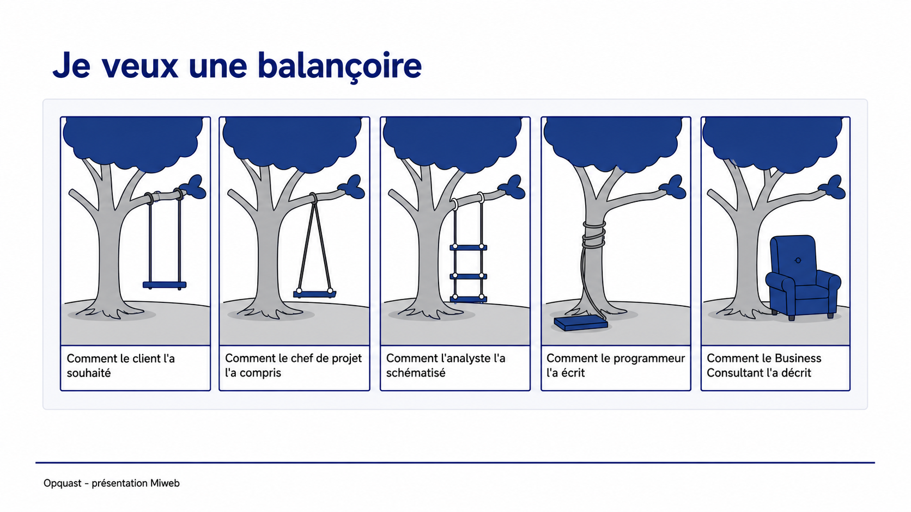

Origine : [2026-09-04-opquast-formation-captures-prolongation, slide 32](../assets/slides/slide-11.png). Correspondance vérifiée : fichier PNG identique.

### Prompt disponible

Consignes conservées dans le [storyboard source](origines/2026-09-04-opquast-formation-captures-prolongation/storyboard-pds.md), section de la slide 32 (ligne 403). L’[export des prompts](origines/2026-09-04-opquast-formation-captures-prolongation/imagegen-prompts-export.txt) ne permet pas de retrouver l’appel original exact.

```text
MASQUE COMMUN — extrait du storyboard

- Format : image finale 16:9, 1600 x 900 px.
- Fond : blanc.
- Structure : bleu nuit institutionnel `#001070`, panneaux gris froid `#F2F3F7`, rouge de contrôle `#E44850` uniquement pour un risque, une alerte ou un point à confirmer.
- Typographie visible : Marianne ; Arial seulement comme fallback explicite.
- Titre : haut gauche, casse de phrase, sans numéro visible.
- Footer : `Opquast - présentation Miweb`, discret en bas à droite.
- Formes : scènes concrètes, objets-systèmes, diagrammes plats, traits fins, flèches logiques, aucun faux logo ou emblème.
- Callout : phrase courte, stable en bas, bleu ou gris froid, jamais rouge.

CONTRAT DE LA SLIDE SOURCE 32 — Je veux une balançoire

- Étape : prolongation, chaîne des interprétations.
- Idée principale : une demande change de représentation lorsqu'elle passe entre les métiers.
- Idée observable : cinq vignettes montrent successivement la demande du client, sa compréhension par le chef de projet, sa schématisation, son écriture et sa description.
- Forme visuelle : cinq panneaux verticaux alignés, mêmes marges et même densité que la slide 39 ; illustrations plates en bleu profond, gris et noir.
- Visuel seul : la balançoire n'est pas représentée de la même manière à chaque étape.
- Libellés exacts : `Comment le client l'a souhaité`, `Comment le chef de projet l'a compris`, `Comment l'analyste l'a schématisé`, `Comment le programmeur l'a écrit`, `Comment le Business Consultant l'a décrit`.
- Phrase à retenir : `Chaque représentation peut créer un écart.`
- Ajout : reprend la logique pédagogique de la capture Image 2, sans modifier les formulations.
- Prépare : la qualité comme attention continue.
- Contraintes critiques : conserver les apostrophes et la casse de `Business Consultant` ; ne pas distribuer de responsabilité dans le visuel.
```

### Notes du présentateur

```text
 Comment le client l'a souhaité
 Comment le chef de projet l'a compris
 Comment l'analyste l'a schématisé
 Comment le programmeur l'a écrit
 Comment le Business Consultant l'a décrit
```

Source : `ppt/notesSlides/notesSlide11.xml`, lié à la slide 11 dans le PPTX fourni.

---

<a id="slide-12"></a>

## Slide 12 — Qualité : une attention constante

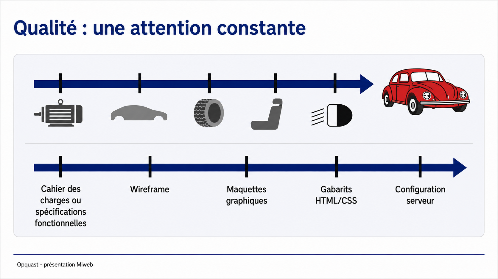

Origine : [2026-09-04-opquast-formation-captures-prolongation, slide 33](../assets/slides/slide-12.png). Correspondance vérifiée : fichier PNG identique.

### Prompt disponible

Consignes conservées dans le [storyboard source](origines/2026-09-04-opquast-formation-captures-prolongation/storyboard-pds.md), section de la slide 33 (ligne 415). L’[export des prompts](origines/2026-09-04-opquast-formation-captures-prolongation/imagegen-prompts-export.txt) ne permet pas de retrouver l’appel original exact.

```text
MASQUE COMMUN — extrait du storyboard

- Format : image finale 16:9, 1600 x 900 px.
- Fond : blanc.
- Structure : bleu nuit institutionnel `#001070`, panneaux gris froid `#F2F3F7`, rouge de contrôle `#E44850` uniquement pour un risque, une alerte ou un point à confirmer.
- Typographie visible : Marianne ; Arial seulement comme fallback explicite.
- Titre : haut gauche, casse de phrase, sans numéro visible.
- Footer : `Opquast - présentation Miweb`, discret en bas à droite.
- Formes : scènes concrètes, objets-systèmes, diagrammes plats, traits fins, flèches logiques, aucun faux logo ou emblème.
- Callout : phrase courte, stable en bas, bleu ou gris froid, jamais rouge.

CONTRAT DE LA SLIDE SOURCE 33 — Qualité : une attention constante

- Étape : prolongation, contrôle continu.
- Idée principale : la qualité se construit par vérifications successives pendant l'assemblage et le projet web.
- Idée observable : une ligne supérieure va des composants à une voiture complète ; une ligne inférieure relie cinq artefacts de projet web.
- Forme visuelle : grand panneau gris clair en deux bandes, flèches bleues, jalons noirs, pictogrammes plats ; accent rouge limité à la voiture finale comme point de vigilance.
- Visuel seul : la qualité n'est pas une étape isolée de fin de parcours.
- Libellés exacts : `Cahier des charges ou spécifications fonctionnelles`, `Wireframe`, `Maquettes graphiques`, `Gabarits HTML/CSS`, `Configuration serveur`.
- Phrase à retenir : `La qualité demande une attention constante.`
- Ajout : reprend les deux lignes de lecture de la capture Image 3.
- Prépare : la question comparative sur le formulaire.
- Contraintes critiques : conserver les cinq libellés sans correction éditoriale ; aucun slogan visible supplémentaire.
```

### Notes du présentateur

```text
La ligne supérieure montre une progression de composants vers une voiture complète. 

La ligne inférieure conserve exactement les cinq libellés suivants :

 Cahier des charges ou spécifications fonctionnelles
 Wireframe
 Maquettes graphiques
 Gabarits HTML/CSS
 Configuration serveur

Relier les deux lignes : dans les deux cas, le résultat dépend de vérifications successives et non d'un contrôle unique en fin de parcours.

Faire distinguer l'assemblage d'un objet de la progression d'un projet web.
```

Source : `ppt/notesSlides/notesSlide12.xml`, lié à la slide 12 dans le PPTX fourni.

---

<a id="slide-13"></a>

## Slide 13 — Les utilisateurs formulent cinq exigences

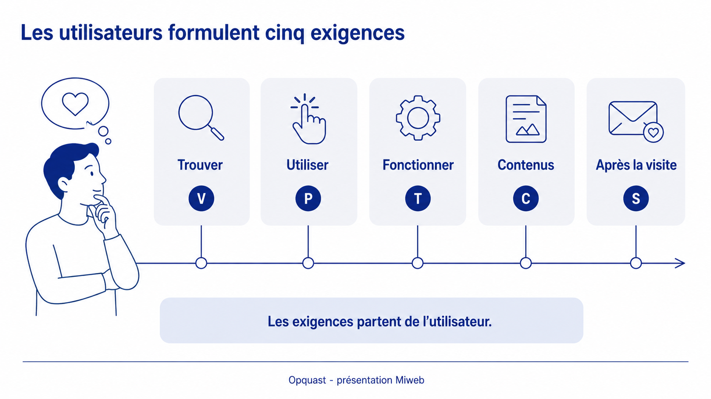

Origine : [2026-09-04-opquast-vptcs-compagnon, slide 03](../assets/slides/slide-13.png). Correspondance vérifiée : pixels RGBA identiques.

### Prompt disponible

Consignes conservées dans le [storyboard source](origines/2026-09-04-opquast-vptcs-compagnon/storyboard-vptcs.md), section de la slide 03 (ligne 49). L’[export des prompts](origines/2026-09-04-opquast-vptcs-compagnon/imagegen-prompts-export.txt) ne permet pas de retrouver l’appel original exact.

```text
MASQUE COMMUN — extrait du storyboard

- Format : 16:9 paysage, image PNG projetable.
- Fond blanc, bleu profond `#001070`, gris froid `#F2F3F7`, rouge réservé aux alertes.
- Titre aligné en haut à gauche, sans numérotation visible.
- Pictogrammes filaires bleus, scènes concrètes, flèches uniquement lorsqu’elles portent une relation.
- Texte visible très condensé : trois à six labels courts et un seul message central.
- Callout bleu ou gris froid centré en bas, jamais rouge.
- Pied de page exact : `Opquast - présentation Miweb`.
- Aucun logo inventé, blason, photographie, dégradé, effet 3D ou texte parasite.

CONTRAT DE LA SLIDE SOURCE 03 — Les utilisateurs formulent cinq exigences

- Rôle : passer de la chronologie aux besoins humains.
- Scène : cinq demandes courtes formulées par un même utilisateur, reliées au parcours.
- Transformation : une expérience globale se lit comme cinq attentes complémentaires.
- Texte visible : `Trouver`, `Utiliser`, `Fonctionner`, `Contenus`, `Après la visite`.
- Callout : `Les exigences partent de l’utilisateur.`
- Risque : transformer les cinq dimensions en checklist technique.
```

### Notes du présentateur

```text
Séquence « Les utilisateurs veulent … » et ses cinq déclinaisons 

Les cinq dimensions traduisent des attentes formulées du point de vue de l’utilisateur.

 Visibilité : les utilisateurs veulent trouver le site.
 Perception : ils veulent utiliser et naviguer.
 Technique : ils veulent que le site fonctionne.
 Contenus : ils veulent des contenus de bonne qualité.
 Services : ils veulent que tout se passe bien après leur visite.

Ces phrases sont complémentaires. 
Une bonne visibilité ne compense pas un service défaillant ; 
Un contenu riche ne compense pas un site inutilisable.
```

Source : `ppt/notesSlides/notesSlide13.xml`, lié à la slide 13 dans le PPTX fourni.

---

<a id="slide-14"></a>

## Slide 14 — Les cinq dimensions de VPTCS

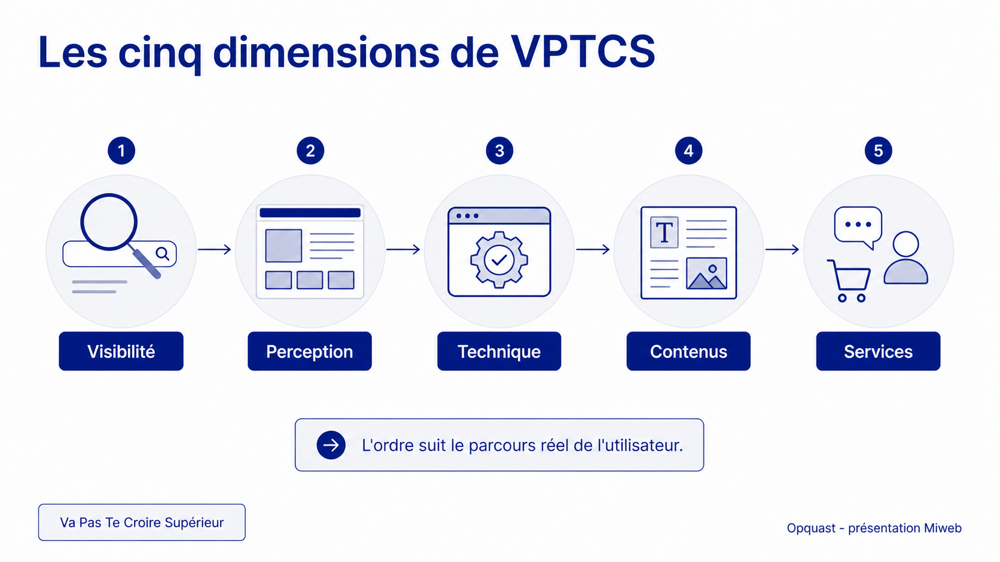

Origine : [2026-09-04-opquast-formation-miweb, slide 13](../assets/slides/slide-14.png). Correspondance vérifiée : fichier PNG identique.

### Prompt disponible

Consignes conservées dans le [storyboard source](origines/2026-09-04-opquast-formation-miweb/storyboard-pds.md), section de la slide 13 (ligne 175). L’[export des prompts](origines/2026-09-04-opquast-formation-miweb/imagegen-prompts-export.txt) ne permet pas de retrouver l’appel original exact.

```text
MASQUE COMMUN — extrait du storyboard

- Format : image finale 16:9, 1600 x 900 px.
- Fond : blanc.
- Structure : bleu nuit institutionnel `#001070`, panneaux gris froid `#F2F3F7`, rouge de contrôle `#E44850` uniquement pour un risque, une alerte ou un point à confirmer.
- Typographie visible : Marianne ; Arial seulement comme fallback explicite.
- Titre : haut gauche, casse de phrase, sans numéro visible.
- Footer : `Opquast - présentation Miweb`, discret en bas à droite.
- Formes : scènes concrètes, objets-systèmes, diagrammes plats, traits fins, flèches logiques, aucun faux logo ou emblème.
- Callout : phrase courte, stable en bas, bleu ou gris froid, jamais rouge.

CONTRAT DE LA SLIDE SOURCE 13 — Les cinq dimensions de VPTCS

- Étape : décomposition du parcours.
- Idée principale : VPTCS ordonne cinq attentes de l'utilisateur.
- Idée observable : cinq stations successives sur un parcours, de la recherche à l'aboutissement.
- Forme visuelle : pipeline utilisateur.
- Visuel seul : les cinq dimensions suivent l'ordre réel de l'expérience.
- Libellés : `Visibilité`, `Perception`, `Technique`, `Contenus`, `Services`.
- Phrase à retenir : `Va Pas Te Croire Supérieur.`
- Ajout : donne le moyen mnémotechnique.
- Prépare : les limites du modèle.
- Contraintes critiques : ordre exact V-P-T-C-S ; phrase mnémotechnique exacte.
```

### Notes du présentateur

```text
VPTCS donne un vocabulaire commun pour parler de l’expérience.
Lire les lettres et leurs noms dans l’ordre : 

 Visibilité : l'utilisateur doit pouvoir trouver le service.
 Perception : il doit pouvoir percevoir, comprendre et utiliser l'interface.
 Technique : le service doit fonctionner correctement.
 Contenus : il doit y trouver des informations utiles et fiables.
 Services : l'action engagée doit aboutir.

Faire remarquer l'ordre : il suit le parcours réel de l'utilisateur, du moment où il cherche jusqu'à celui où il obtient satisfaction.
```

Source : `ppt/notesSlides/notesSlide14.xml`, lié à la slide 14 dans le PPTX fourni.

---

<a id="slide-15"></a>

## Slide 15 — Moyen mnémotechnique

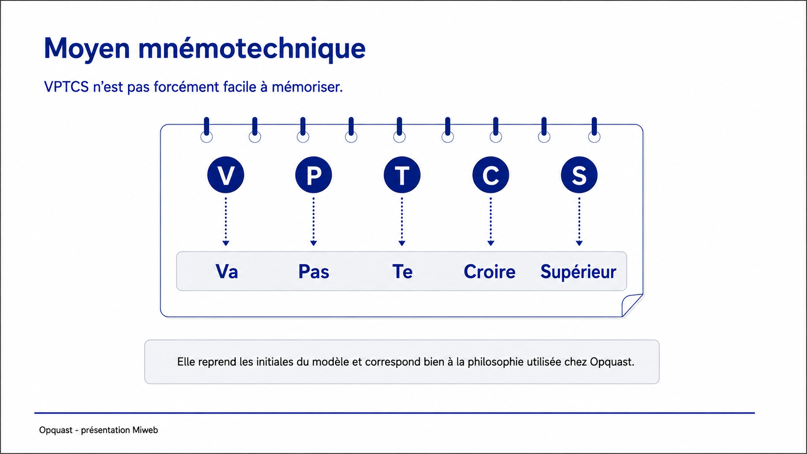

Origine : [2026-09-04-opquast-formation-vptcs-prolongation, slide 33](../assets/slides/slide-15.png). Correspondance vérifiée : fichier PNG identique.

### Prompt disponible

Consignes conservées dans le [storyboard source](origines/2026-09-04-opquast-formation-vptcs-prolongation/storyboard-pds.md), section de la slide 33 (ligne 413). L’[export des prompts](origines/2026-09-04-opquast-formation-vptcs-prolongation/imagegen-prompts-export.txt) ne permet pas de retrouver l’appel original exact.

```text
MASQUE COMMUN — extrait du storyboard

- Format : image finale 16:9, 1600 x 900 px.
- Fond : blanc.
- Structure : bleu nuit institutionnel `#001070`, panneaux gris froid `#F2F3F7`, rouge de contrôle `#E44850` uniquement pour un risque, une alerte ou un point à confirmer.
- Typographie visible : Marianne ; Arial seulement comme fallback explicite.
- Titre : haut gauche, casse de phrase, sans numéro visible.
- Footer : `Opquast - présentation Miweb`, discret en bas à droite.
- Formes : scènes concrètes, objets-systèmes, diagrammes plats, traits fins, flèches logiques, aucun faux logo ou emblème.
- Callout : phrase courte, stable en bas, bleu ou gris froid, jamais rouge.

CONTRAT DE LA SLIDE SOURCE 33 — Moyen mnémotechnique

- Étape : mémorisation.
- Idée principale : la phrase « Va Pas Te Croire Supérieur » reprend les initiales de VPTCS.
- Scène : une personne associe les cinq lettres à une phrase affichée sur une fiche de mémorisation.
- Transformation visible : lettres VPTCS -> phrase mnémotechnique.
- Texte visible : `Moyen mnémotechnique`, `VPTCS`, `Va Pas Te Croire Supérieur`.
- Prépare : les usages du modèle.
- Contraintes critiques : conserver exactement les cinq mots et leurs majuscules.
```

### Notes du présentateur

```text
Moyen mnémotechnique

VPTCS n’est pas forcément facile à mémoriser.

Vous pouvez retenir la phrase suivante :

> Va Pas Te Croire Supérieur
```

Source : `ppt/notesSlides/notesSlide15.xml`, lié à la slide 15 dans le PPTX fourni.

---

<a id="slide-16"></a>

## Slide 16 — Différencier expérience utilisateur et interface utilisateur

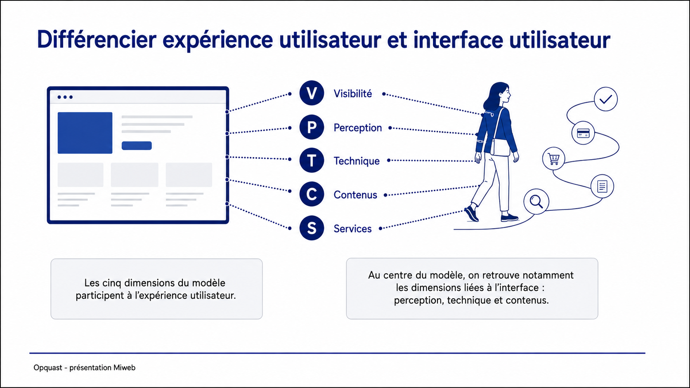

Origine : [2026-09-04-opquast-formation-vptcs-prolongation, slide 34](../assets/slides/slide-16.png). Correspondance vérifiée : fichier PNG identique.

### Prompt disponible

Consignes conservées dans le [storyboard source](origines/2026-09-04-opquast-formation-vptcs-prolongation/storyboard-pds.md), section de la slide 34 (ligne 423). L’[export des prompts](origines/2026-09-04-opquast-formation-vptcs-prolongation/imagegen-prompts-export.txt) ne permet pas de retrouver l’appel original exact.

```text
MASQUE COMMUN — extrait du storyboard

- Format : image finale 16:9, 1600 x 900 px.
- Fond : blanc.
- Structure : bleu nuit institutionnel `#001070`, panneaux gris froid `#F2F3F7`, rouge de contrôle `#E44850` uniquement pour un risque, une alerte ou un point à confirmer.
- Typographie visible : Marianne ; Arial seulement comme fallback explicite.
- Titre : haut gauche, casse de phrase, sans numéro visible.
- Footer : `Opquast - présentation Miweb`, discret en bas à droite.
- Formes : scènes concrètes, objets-systèmes, diagrammes plats, traits fins, flèches logiques, aucun faux logo ou emblème.
- Callout : phrase courte, stable en bas, bleu ou gris froid, jamais rouge.

CONTRAT DE LA SLIDE SOURCE 34 — Différencier expérience utilisateur et interface utilisateur

- Étape : premier usage.
- Idée principale : les cinq dimensions participent à l’expérience utilisateur ; perception, technique et contenus sont liées à l’interface.
- Scène : une interface visible à gauche et un parcours utilisateur à droite, reliés par VPTCS.
- Transformation visible : écran -> expérience utilisateur.
- Texte visible : `Différencier expérience utilisateur et interface utilisateur`, `expérience utilisateur`, `interface utilisateur`, `Visibilité`, `Perception`, `Technique`, `Contenus`, `Services`.
- Prépare : la valeur ajoutée du site.
- Contraintes critiques : ne pas réduire l’expérience utilisateur à l’interface ; conserver les cinq dimensions.
```

### Notes du présentateur

```text
Différencier expérience utilisateur et interface utilisateur

Les cinq dimensions du modèle participent à l’expérience utilisateur.

Au centre du modèle, on retrouve notamment les dimensions liées à l’interface : perception, technique et contenus.

Relier les cinq dimensions à l’expérience utilisateur et distinguer les dimensions liées à l’interface.
```

Source : `ppt/notesSlides/notesSlide16.xml`, lié à la slide 16 dans le PPTX fourni.

---

<a id="slide-17"></a>

## Slide 17 — UI est visible, UX traverse le parcours


Origine : [2026-09-04-opquast-vptcs-compagnon, slide 07](../assets/slides/slide-17.png). Correspondance vérifiée : pixels RGBA identiques.

### Prompt disponible

Consignes conservées dans le [storyboard source](origines/2026-09-04-opquast-vptcs-compagnon/storyboard-vptcs.md), section de la slide 07 (ligne 85). L’[export des prompts](origines/2026-09-04-opquast-vptcs-compagnon/imagegen-prompts-export.txt) ne permet pas de retrouver l’appel original exact.

```text
MASQUE COMMUN — extrait du storyboard

- Format : 16:9 paysage, image PNG projetable.
- Fond blanc, bleu profond `#001070`, gris froid `#F2F3F7`, rouge réservé aux alertes.
- Titre aligné en haut à gauche, sans numérotation visible.
- Pictogrammes filaires bleus, scènes concrètes, flèches uniquement lorsqu’elles portent une relation.
- Texte visible très condensé : trois à six labels courts et un seul message central.
- Callout bleu ou gris froid centré en bas, jamais rouge.
- Pied de page exact : `Opquast - présentation Miweb`.
- Aucun logo inventé, blason, photographie, dégradé, effet 3D ou texte parasite.

CONTRAT DE LA SLIDE SOURCE 07 — UI est visible, UX traverse le parcours

- Rôle : expliquer simplement la différence entre UI et UX.
- Scène : à gauche l’interface visible ; à droite le parcours complet de l’utilisateur avant, pendant et après l’écran.
- Transformation : l’écran devient une étape d’une expérience plus large.
- Texte visible : `UI`, `UX`, `Écran`, `Parcours`, `Avant`, `Après`.
- Callout : `L’UI se voit ; l’UX se vit.`
- Risque : opposer UI et UX au lieu de les articuler.
```

### Notes du présentateur

```text
L’interface utilisateur est une partie visible ; l’expérience utilisateur comprend le parcours complet.

Expliquer simplement la différence entre UI et UX  

UI  
A B 
UX  
Visibilité  
Perception  
Technique  
Contenus  
Services

UI renvoie à l’interface, à ce que l’on voit et manipule à un moment donné. 
UX renvoie à l’expérience plus large : trouver, comprendre, utiliser, terminer l’action et vivre l’après.

Ne pas opposer les deux notions. Une bonne UI contribue à l’UX, mais ne suffit pas à elle seule à garantir une bonne expérience.
```

Source : `ppt/notesSlides/notesSlide17.xml`, lié à la slide 17 dans le PPTX fourni.

---

<a id="slide-18"></a>

## Slide 18 — VPTCS, le modèle derrière les règles

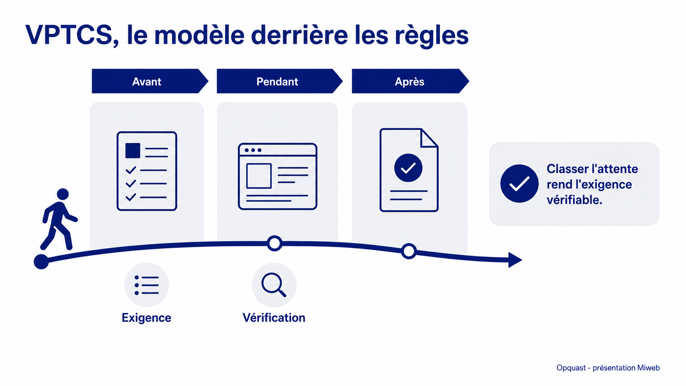

Origine : [2026-09-04-opquast-formation-miweb, slide 12](../assets/slides/slide-18.png). Correspondance vérifiée : fichier PNG identique.

### Prompt disponible

Consignes conservées dans le [storyboard source](origines/2026-09-04-opquast-formation-miweb/storyboard-pds.md), section de la slide 12 (ligne 163). L’[export des prompts](origines/2026-09-04-opquast-formation-miweb/imagegen-prompts-export.txt) ne permet pas de retrouver l’appel original exact.

```text
MASQUE COMMUN — extrait du storyboard

- Format : image finale 16:9, 1600 x 900 px.
- Fond : blanc.
- Structure : bleu nuit institutionnel `#001070`, panneaux gris froid `#F2F3F7`, rouge de contrôle `#E44850` uniquement pour un risque, une alerte ou un point à confirmer.
- Typographie visible : Marianne ; Arial seulement comme fallback explicite.
- Titre : haut gauche, casse de phrase, sans numéro visible.
- Footer : `Opquast - présentation Miweb`, discret en bas à droite.
- Formes : scènes concrètes, objets-systèmes, diagrammes plats, traits fins, flèches logiques, aucun faux logo ou emblème.
- Callout : phrase courte, stable en bas, bleu ou gris froid, jamais rouge.

CONTRAT DE LA SLIDE SOURCE 12 — VPTCS, le modèle derrière les règles

- Étape : entrée dans le modèle utilisateur.
- Idée principale : les règles suivent l'expérience chronologique de l'utilisateur.
- Idée observable : un utilisateur avance sur un chemin `Avant`, `Pendant`, `Après`, jalonné de contrôles.
- Forme visuelle : parcours utilisateur.
- Visuel seul : les exigences vagues deviennent des étapes observables.
- Libellés : `Avant`, `Pendant`, `Après`, `Exigence`, `Vérification`.
- Phrase à retenir : `Classer l'attente rend l'exigence vérifiable.`
- Ajout : introduit VPTCS et son origine.
- Prépare : les cinq dimensions.
- Contraintes critiques : ne pas présenter VPTCS comme une norme réglementaire ; conserver l'idée du refus des exigences invérifiables dans les notes.
```

### Notes du présentateur

```text
Les 245 règles ne sont pas une accumulation. 

Elles sont classées selon un modèle antérieur, VPTCS, qui analyse la qualité d'un service numérique du point de vue de l'utilisateur.

Son postulat de départ : l'utilisateur évalue son expérience de façon chronologique, avant, pendant et après son usage.

Le modèle est né d'un refus, celui des exigences invérifiables. 

Écrire dans un cahier des charges « le site sera ergonomique » n'engage personne. 

Classer les exigences par ce que l'utilisateur attend permet au contraire de les vérifier.

Le modèle a une vingtaine d'années : c'est un argument de solidité
```

Source : `ppt/notesSlides/notesSlide18.xml`, lié à la slide 18 dans le PPTX fourni.

---

<a id="slide-19"></a>

## Slide 19 — À chaque dimension ses métiers

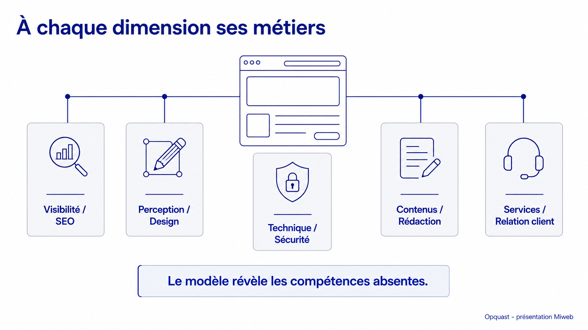

Origine : [2026-09-04-opquast-formation-miweb, slide 15](../assets/slides/slide-19.png). Correspondance vérifiée : fichier PNG identique.

### Prompt disponible

Consignes conservées dans le [storyboard source](origines/2026-09-04-opquast-formation-miweb/storyboard-pds.md), section de la slide 15 (ligne 199). L’[export des prompts](origines/2026-09-04-opquast-formation-miweb/imagegen-prompts-export.txt) ne permet pas de retrouver l’appel original exact.

```text
MASQUE COMMUN — extrait du storyboard

- Format : image finale 16:9, 1600 x 900 px.
- Fond : blanc.
- Structure : bleu nuit institutionnel `#001070`, panneaux gris froid `#F2F3F7`, rouge de contrôle `#E44850` uniquement pour un risque, une alerte ou un point à confirmer.
- Typographie visible : Marianne ; Arial seulement comme fallback explicite.
- Titre : haut gauche, casse de phrase, sans numéro visible.
- Footer : `Opquast - présentation Miweb`, discret en bas à droite.
- Formes : scènes concrètes, objets-systèmes, diagrammes plats, traits fins, flèches logiques, aucun faux logo ou emblème.
- Callout : phrase courte, stable en bas, bleu ou gris froid, jamais rouge.

CONTRAT DE LA SLIDE SOURCE 15 — À chaque dimension ses métiers

- Étape : cartographie des compétences.
- Idée principale : chaque dimension mobilise des métiers différents.
- Idée observable : cinq stations relient une dimension à une équipe ou compétence.
- Forme visuelle : carte de compétences.
- Visuel seul : le service de qualité dépend d'une équipe élargie.
- Libellés : `Visibilité / SEO`, `Perception / Design`, `Technique / Sécurité`, `Contenus / Rédaction`, `Services / Relation client`.
- Phrase à retenir : `Le modèle révèle les compétences absentes.`
- Ajout : traduit VPTCS en organisation.
- Prépare : la question de la valeur.
- Contraintes critiques : conserver les cinq correspondances des notes ; éviter un empilement de métiers illisible.
```

### Notes du présentateur

```text
Le modèle se lit aussi comme une cartographie des compétences.

 Visibilité : référencement, webmarketing.
 Perception : ergonomie, design, accessibilité.
 Technique : développement, hébergement, sécurité.
 Contenus : rédaction, traduction, juridique.
 Services : logistique, relation client, après-vente.
```

Source : `ppt/notesSlides/notesSlide19.xml`, lié à la slide 19 dans le PPTX fourni.

---

<a id="slide-20"></a>

## Slide 20 — La transversalité relie les métiers

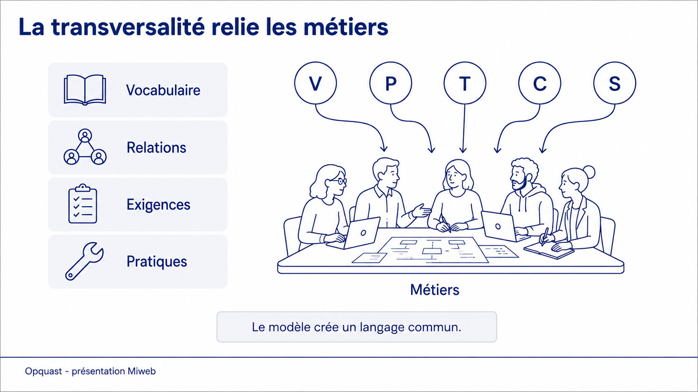

Origine : [2026-09-04-opquast-vptcs-compagnon, slide 16](../assets/slides/slide-20.png). Correspondance vérifiée : pixels RGBA identiques.

### Prompt disponible

Consignes conservées dans le [storyboard source](origines/2026-09-04-opquast-vptcs-compagnon/storyboard-vptcs.md), section de la slide 16 (ligne 167). L’[export des prompts](origines/2026-09-04-opquast-vptcs-compagnon/imagegen-prompts-export.txt) ne permet pas de retrouver l’appel original exact.

```text
MASQUE COMMUN — extrait du storyboard

- Format : 16:9 paysage, image PNG projetable.
- Fond blanc, bleu profond `#001070`, gris froid `#F2F3F7`, rouge réservé aux alertes.
- Titre aligné en haut à gauche, sans numérotation visible.
- Pictogrammes filaires bleus, scènes concrètes, flèches uniquement lorsqu’elles portent une relation.
- Texte visible très condensé : trois à six labels courts et un seul message central.
- Callout bleu ou gris froid centré en bas, jamais rouge.
- Pied de page exact : `Opquast - présentation Miweb`.
- Aucun logo inventé, blason, photographie, dégradé, effet 3D ou texte parasite.

CONTRAT DE LA SLIDE SOURCE 16 — La transversalité relie les métiers

- Rôle : conclure la démonstration du modèle.
- Scène : les cinq dimensions convergent vers quatre points de coopération : vocabulaire, relations, exigences, pratiques.
- Transformation : un modèle commun rend les collaborations opérables.
- Texte visible : `Vocabulaire`, `Relations`, `Exigences`, `Pratiques`, `Métiers`.
- Callout : `Le modèle crée un langage commun.`
- Risque : transformer la transversalité en abstraction sans résultat concret.
```

### Notes du présentateur

```text
La transversalité se construit par un vocabulaire, des relations, des exigences et des pratiques partagés.

Le modèle offre un point d’appui commun pour organiser ces éléments.

Ce n’est pas une couche théorique supplémentaire : c’est une manière de rendre les collaborations et les arbitrages plus explicites.
```

Source : `ppt/notesSlides/notesSlide20.xml`, lié à la slide 20 dans le PPTX fourni.

---

<a id="slide-21"></a>

## Slide 21 — (se) répartir les responsabilités

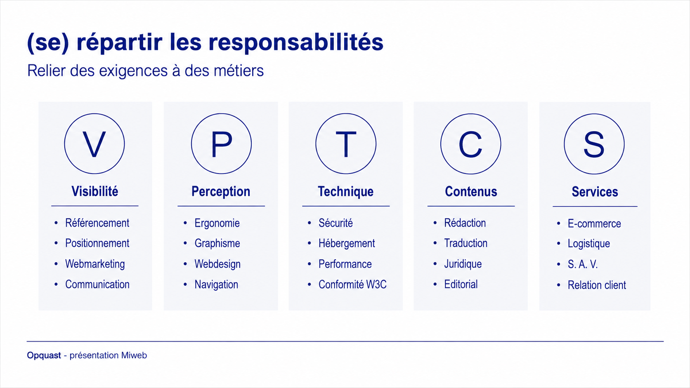

Origine : [2026-09-04-opquast-vptcs-compagnon-verbatim, slide 09](../assets/slides/slide-21.png). Correspondance vérifiée : fichier PNG identique.

### Prompt disponible

Consignes conservées dans le [storyboard source](origines/2026-09-04-opquast-vptcs-compagnon-verbatim/storyboard-vptcs-verbatim.md), section de la slide 09 (ligne 80). L’[export des prompts](origines/2026-09-04-opquast-vptcs-compagnon-verbatim/imagegen-prompts-export.txt) ne permet pas de retrouver l’appel original exact.

```text
MASQUE COMMUN — extrait du storyboard

- Format 16:9, image raster nette, fond blanc.
- Bleu profond `#001070` dominant, gris très clair `#F2F3F7` pour les zones de regroupement.
- Rouge réservé à une alerte ou à une réserve ; aucune utilisation décorative.
- Typographie Marianne, avec Arial comme fallback explicite.
- Titre ou bloc-titre en haut à gauche, marge et hauteur constantes.
- Pied de page exact : `Opquast - présentation Miweb`.
- Aucun logo inventé, blason, photographie, dégradé, effet 3D ou numéro de slide.
- Texte projeté fortement condensé ; le détail source reste dans les notes.

CONTRAT DE LA SLIDE SOURCE 09 — (se) répartir les responsabilités

- Scène : cinq colonnes métiers distribuent les responsabilités autour des cinq dimensions.
- Transformation : une exigence devient une responsabilité identifiable par métier.
- Texte exact visible : `(se) répartir les responsabilités`, `Relier des exigences à des métiers`, et le mapping V-P-T-C-S source.
- Contraintes critiques : ne supprimer aucun métier ; conserver `Conformité W3C`, `Editorial`, `S. A. V.` et `Relation client` tels qu’écrits dans la source.
```

### Notes du présentateur

```text
(se) répartir les responsabilités  
Relier des exigences à des métiers  
Visibilité  
Référencement  
Positionnement  
Webmarketing  
Communication  
Perception  
Ergonomie  
Graphisme  
Webdesign  
Navigation  
Technique  
Sécurité  
Hébergement  
Performance  
Conformité W3C  
Contenus  
Rédaction  
Traduction  
Juridique  
Editorial  
Services  
E-commerce  
Logistique  
S. A. V.  
Relation client
```

Source : `ppt/notesSlides/notesSlide21.xml`, lié à la slide 21 dans le PPTX fourni.

---

<a id="slide-22"></a>

## Slide 22 — Un modèle sert à agir


Origine : [2026-09-04-opquast-vptcs-compagnon, slide 06](../assets/slides/slide-22.png). Correspondance vérifiée : pixels RGBA identiques.

### Prompt disponible

Consignes conservées dans le [storyboard source](origines/2026-09-04-opquast-vptcs-compagnon/storyboard-vptcs.md), section de la slide 06 (ligne 76). L’[export des prompts](origines/2026-09-04-opquast-vptcs-compagnon/imagegen-prompts-export.txt) ne permet pas de retrouver l’appel original exact.

```text
MASQUE COMMUN — extrait du storyboard

- Format : 16:9 paysage, image PNG projetable.
- Fond blanc, bleu profond `#001070`, gris froid `#F2F3F7`, rouge réservé aux alertes.
- Titre aligné en haut à gauche, sans numérotation visible.
- Pictogrammes filaires bleus, scènes concrètes, flèches uniquement lorsqu’elles portent une relation.
- Texte visible très condensé : trois à six labels courts et un seul message central.
- Callout bleu ou gris froid centré en bas, jamais rouge.
- Pied de page exact : `Opquast - présentation Miweb`.
- Aucun logo inventé, blason, photographie, dégradé, effet 3D ou texte parasite.

CONTRAT DE LA SLIDE SOURCE 06 — Un modèle sert à agir

- Rôle : donner les usages du modèle.
- Scène : une même représentation alimente quatre gestes : comprendre, organiser, mesurer, prédire.
- Transformation : la carte devient un instrument de décision.
- Texte visible : `Comprendre`, `Organiser`, `Mesurer`, `Prédire`.
- Callout : `Expliquer simplement pour mieux décider.`
- Risque : promettre une prédiction automatique ou certaine.
```

### Notes du présentateur

```text
Section « Pour quoi faire ? » 

Le modèle a quatre fonctions : comprendre, organiser, mesurer et prédire.

Le premier bénéfice est l’explication simple. 

Ensuite, le modèle aide à organiser les responsabilités et les sujets. 

Il permet aussi de mesurer ce qui est suivi. 

Enfin, il peut soutenir une prédiction ou une hypothèse, sans transformer cette prédiction en certitude.
```

Source : `ppt/notesSlides/notesSlide22.xml`, lié à la slide 22 dans le PPTX fourni.

---

<a id="slide-23"></a>

## Slide 23 — Mettre en évidence la valeur ajoutée du site


Origine : [2026-09-04-opquast-formation-vptcs-prolongation, slide 35](../assets/slides/slide-23.png). Correspondance vérifiée : fichier PNG identique.

### Prompt disponible

Consignes conservées dans le [storyboard source](origines/2026-09-04-opquast-formation-vptcs-prolongation/storyboard-pds.md), section de la slide 35 (ligne 433). L’[export des prompts](origines/2026-09-04-opquast-formation-vptcs-prolongation/imagegen-prompts-export.txt) ne permet pas de retrouver l’appel original exact.

```text
MASQUE COMMUN — extrait du storyboard

- Format : image finale 16:9, 1600 x 900 px.
- Fond : blanc.
- Structure : bleu nuit institutionnel `#001070`, panneaux gris froid `#F2F3F7`, rouge de contrôle `#E44850` uniquement pour un risque, une alerte ou un point à confirmer.
- Typographie visible : Marianne ; Arial seulement comme fallback explicite.
- Titre : haut gauche, casse de phrase, sans numéro visible.
- Footer : `Opquast - présentation Miweb`, discret en bas à droite.
- Formes : scènes concrètes, objets-systèmes, diagrammes plats, traits fins, flèches logiques, aucun faux logo ou emblème.
- Callout : phrase courte, stable en bas, bleu ou gris froid, jamais rouge.

CONTRAT DE LA SLIDE SOURCE 35 — Mettre en évidence la valeur ajoutée du site

- Étape : deuxième usage.
- Idée principale : la valeur ajoutée se repère en particulier dans les contenus et les services.
- Scène : contenus et services au centre d’un site, reliés à une valeur ajoutée identifiable.
- Transformation visible : site -> contenus et services -> valeur ajoutée.
- Texte visible : `Mettre en évidence la valeur ajoutée du site`, `ses contenus`, `ses services`.
- Prépare : la cartographie des métiers.
- Contraintes critiques : conserver les deux éléments exacts `ses contenus` et `ses services`.
```

### Notes du présentateur

```text
Mettre en évidence la valeur ajoutée du site

Le modèle permet aussi d’identifier la valeur ajoutée d’un site, en particulier à travers :

 ses contenus ;
 ses services. 

La visibilité, la perception et la technique servent à rendre cette valeur trouvable, accessible et utilisable.

Un commanditaire paie deux fois : 

une fois la prestation technique et graphique, 
une fois la production de ses propres contenus et la tenue de ses propres services.

Formuler la question utile : qui, chez nous, produira les contenus et fera vivre le service ?
```

Source : `ppt/notesSlides/notesSlide23.xml`, lié à la slide 23 dans le PPTX fourni.

---

<a id="slide-24"></a>

## Slide 24 — L'utilisateur ne voit pas nos silos


Origine : [2026-09-04-opquast-formation-miweb, slide 17](../assets/slides/slide-24.png). Correspondance vérifiée : fichier PNG identique.

### Prompt disponible

Consignes conservées dans le [storyboard source](origines/2026-09-04-opquast-formation-miweb/storyboard-pds.md), section de la slide 17 (ligne 223). L’[export des prompts](origines/2026-09-04-opquast-formation-miweb/imagegen-prompts-export.txt) ne permet pas de retrouver l’appel original exact.

```text
MASQUE COMMUN — extrait du storyboard

- Format : image finale 16:9, 1600 x 900 px.
- Fond : blanc.
- Structure : bleu nuit institutionnel `#001070`, panneaux gris froid `#F2F3F7`, rouge de contrôle `#E44850` uniquement pour un risque, une alerte ou un point à confirmer.
- Typographie visible : Marianne ; Arial seulement comme fallback explicite.
- Titre : haut gauche, casse de phrase, sans numéro visible.
- Footer : `Opquast - présentation Miweb`, discret en bas à droite.
- Formes : scènes concrètes, objets-systèmes, diagrammes plats, traits fins, flèches logiques, aucun faux logo ou emblème.
- Callout : phrase courte, stable en bas, bleu ou gris froid, jamais rouge.

CONTRAT DE LA SLIDE SOURCE 17 — L'utilisateur ne voit pas nos silos

- Étape : charnière vers le pilotage.
- Idée principale : l'utilisateur reçoit un service unique malgré les circuits internes séparés.
- Idée observable : deux tours `Communication` et `Informatique` laissent un pont incomplet vers un utilisateur.
- Forme visuelle : comparaison de périmètres et pont cassé.
- Visuel seul : un défaut de coordination suffit à interrompre le service.
- Libellés : `Communication`, `Informatique`, `Budget`, `Utilisateur`.
- Phrase à retenir : `L'utilisateur reçoit un seul service.`
- Ajout : rend la transversalité nécessaire.
- Prépare : QSE-IP comme réponse de pilotage.
- Contraintes critiques : ne pas opposer les équipes ; montrer le problème des circuits de décision.
```

### Notes du présentateur

```text
Quand une page est inutilisable, la cause technique, graphique ou éditoriale est indifférente à l'utilisateur. Le service n'est pas rendu.

Les organisations séparent souvent deux circuits de décision, la communication et l'informatique, avec des budgets sans commune mesure.

La transversalité est une condition nécessaire de la réussite d'un projet web. Elle n'est pas suffisante, mais sans elle rien ne tient.

Faire de cette slide la charnière de la présentation. Passer du modèle d'analyse à la question du pilotage, puis enchaîner sur QSE-IP.
```

Source : `ppt/notesSlides/notesSlide24.xml`, lié à la slide 24 dans le PPTX fourni.

---

<a id="slide-25"></a>

## Slide 25 — Pour l’utilisateur, tout devient un seul service

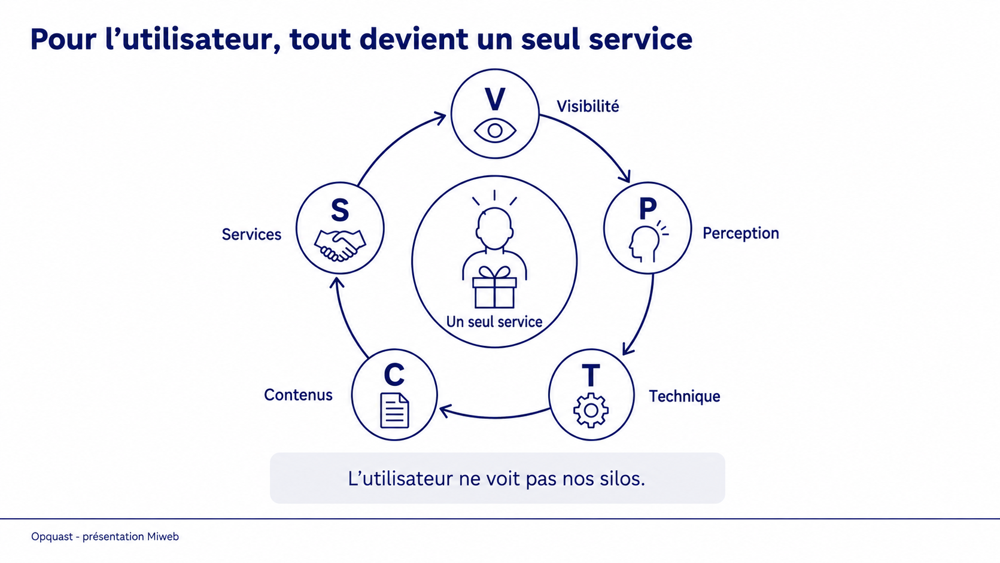

Origine : [2026-09-04-opquast-vptcs-compagnon, slide 15](../assets/slides/slide-25.png). Correspondance vérifiée : pixels RGBA identiques.

### Prompt disponible

Consignes conservées dans le [storyboard source](origines/2026-09-04-opquast-vptcs-compagnon/storyboard-vptcs.md), section de la slide 15 (ligne 158). L’[export des prompts](origines/2026-09-04-opquast-vptcs-compagnon/imagegen-prompts-export.txt) ne permet pas de retrouver l’appel original exact.

```text
MASQUE COMMUN — extrait du storyboard

- Format : 16:9 paysage, image PNG projetable.
- Fond blanc, bleu profond `#001070`, gris froid `#F2F3F7`, rouge réservé aux alertes.
- Titre aligné en haut à gauche, sans numérotation visible.
- Pictogrammes filaires bleus, scènes concrètes, flèches uniquement lorsqu’elles portent une relation.
- Texte visible très condensé : trois à six labels courts et un seul message central.
- Callout bleu ou gris froid centré en bas, jamais rouge.
- Pied de page exact : `Opquast - présentation Miweb`.
- Aucun logo inventé, blason, photographie, dégradé, effet 3D ou texte parasite.

CONTRAT DE LA SLIDE SOURCE 15 — Pour l’utilisateur, tout devient un seul service

- Rôle : retourner au point de vue utilisateur.
- Scène : une personne au centre reçoit un service unique, autour duquel les cinq dimensions se rejoignent.
- Transformation : les silos organisationnels disparaissent dans l’expérience vécue.
- Texte visible : `V`, `P`, `T`, `C`, `S`, `Un seul service`.
- Callout : `L’utilisateur ne voit pas nos silos.`
- Risque : afficher cinq services séparés au lieu d’une expérience unifiée.
```

### Notes du présentateur

```text
L’utilisateur ne perçoit pas les limites de l’organisation interne.

Le corpus conclut la séquence des silos par « Pas de silos pour l’utilisateur ». Les cinq dimensions VPTCS convergent autour d’une expérience vécue comme un tout.

Cette slide doit être présentée comme un changement de point de vue : on ne demande pas à l’utilisateur de comprendre l’organigramme pour réussir son parcours.
```

Source : `ppt/notesSlides/notesSlide25.xml`, lié à la slide 25 dans le PPTX fourni.

---

<a id="slide-26"></a>

## Slide 26 — Les silos organisent des décisions différentes

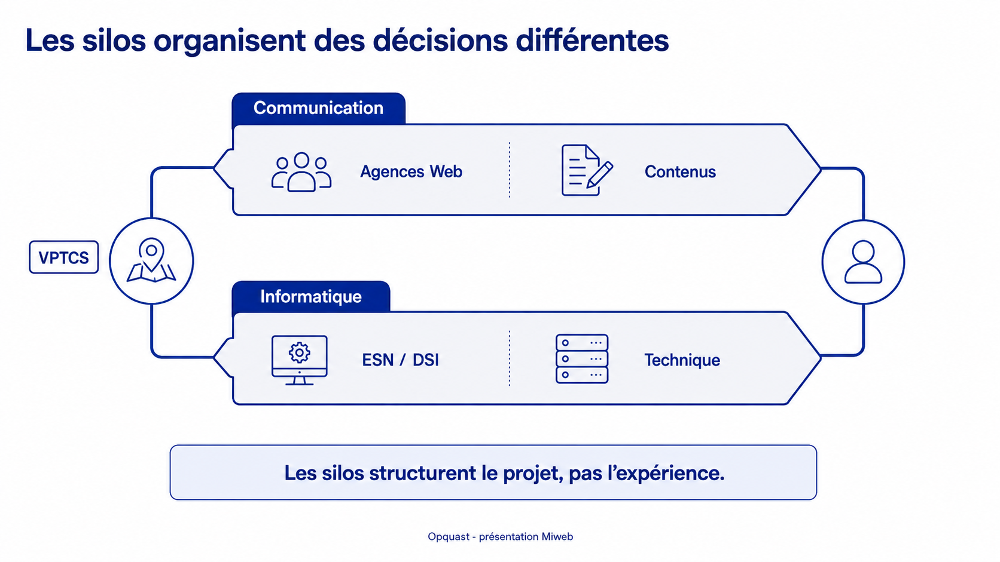

Origine : [2026-09-04-opquast-vptcs-compagnon, slide 14](../assets/slides/slide-26.png). Correspondance vérifiée : pixels RGBA identiques.

### Prompt disponible

Consignes conservées dans le [storyboard source](origines/2026-09-04-opquast-vptcs-compagnon/storyboard-vptcs.md), section de la slide 14 (ligne 149). L’[export des prompts](origines/2026-09-04-opquast-vptcs-compagnon/imagegen-prompts-export.txt) ne permet pas de retrouver l’appel original exact.

```text
MASQUE COMMUN — extrait du storyboard

- Format : 16:9 paysage, image PNG projetable.
- Fond blanc, bleu profond `#001070`, gris froid `#F2F3F7`, rouge réservé aux alertes.
- Titre aligné en haut à gauche, sans numérotation visible.
- Pictogrammes filaires bleus, scènes concrètes, flèches uniquement lorsqu’elles portent une relation.
- Texte visible très condensé : trois à six labels courts et un seul message central.
- Callout bleu ou gris froid centré en bas, jamais rouge.
- Pied de page exact : `Opquast - présentation Miweb`.
- Aucun logo inventé, blason, photographie, dégradé, effet 3D ou texte parasite.

CONTRAT DE LA SLIDE SOURCE 14 — Les silos organisent des décisions différentes

- Rôle : montrer les deux circuits de décision du corpus.
- Scène : deux couloirs parallèles, `Communication` et `Informatique`, conduisent vers des décisions différentes.
- Transformation : une même expérience est découpée en circuits séparés.
- Texte visible : `Communication`, `Informatique`, `Agences Web`, `ESN / DSI`, `Contenus`, `Technique`.
- Callout : `Les silos structurent le projet, pas l’expérience.`
- Risque : présenter les deux circuits comme équivalents ou indépendants de l’utilisateur.
```

### Notes du présentateur

```text
Les circuits de décision peuvent découper le projet selon des silos de communication ou d’informatique.

Le premier circuit est présenté comme un silo communication : agences Web et communication, avec une dominante Contenus. 
Le second est présenté comme un silo informatique : agences Web, ESN ou SSII, DSI et métiers, avec une dominante Technique.

Le point n’est pas de juger les équipes. 

Il est de montrer qu’une organisation interne peut produire des décisions séparées alors que l’utilisateur attend une expérience continue.
```

Source : `ppt/notesSlides/notesSlide26.xml`, lié à la slide 26 dans le PPTX fourni.

---

<a id="slide-27"></a>

## Slide 27 — Les cinq domaines de QSE-IP


Origine : [2026-09-04-opquast-formation-miweb, slide 19](../assets/slides/slide-27.png). Correspondance vérifiée : fichier PNG identique.

### Prompt disponible

Consignes conservées dans le [storyboard source](origines/2026-09-04-opquast-formation-miweb/storyboard-pds.md), section de la slide 19 (ligne 247). L’[export des prompts](origines/2026-09-04-opquast-formation-miweb/imagegen-prompts-export.txt) ne permet pas de retrouver l’appel original exact.

```text
MASQUE COMMUN — extrait du storyboard

- Format : image finale 16:9, 1600 x 900 px.
- Fond : blanc.
- Structure : bleu nuit institutionnel `#001070`, panneaux gris froid `#F2F3F7`, rouge de contrôle `#E44850` uniquement pour un risque, une alerte ou un point à confirmer.
- Typographie visible : Marianne ; Arial seulement comme fallback explicite.
- Titre : haut gauche, casse de phrase, sans numéro visible.
- Footer : `Opquast - présentation Miweb`, discret en bas à droite.
- Formes : scènes concrètes, objets-systèmes, diagrammes plats, traits fins, flèches logiques, aucun faux logo ou emblème.
- Callout : phrase courte, stable en bas, bleu ou gris froid, jamais rouge.

CONTRAT DE LA SLIDE SOURCE 19 — Les cinq domaines de QSE-IP

- Étape : décomposition du pilotage.
- Idée principale : les cinq domaines doivent être traités ensemble.
- Idée observable : cinq piliers équilibrés alimentent un même service numérique.
- Forme visuelle : cinq piliers convergents.
- Visuel seul : qualité, sécurité, environnement, inclusion et privacy sont interdépendants.
- Libellés : `Qualité`, `Sécurité`, `Environnement`, `Inclusion`, `Privacy`.
- Phrase à retenir : `Traiter les domaines ensemble évite les arbitrages contradictoires.`
- Ajout : détaille QSE-IP.
- Prépare : le rapprochement avec le référentiel.
- Contraintes critiques : l'inclusion dépasse l'accessibilité technique ; conserver diversité, parité et non-discrimination dans les notes.
```

### Notes du présentateur

```text
QSE-IP

 Qualité : le service rend ce qu'il promet.
 Sécurité : il résiste aux atteintes.
 Environnement : il limite son empreinte.
 Inclusion : accessibilité aux personnes handicapées, mais aussi diversité, parité et non-discrimination.
 Privacy : préservation des données personnelles.

Insister sur l'extension du I : l'inclusion ne se réduit pas à l'accessibilité technique.

 Ces cinq domaines se traitent de front ; séparés, ils produisent des arbitrages contradictoires.
```

Source : `ppt/notesSlides/notesSlide27.xml`, lié à la slide 27 dans le PPTX fourni.

---

<a id="slide-28"></a>

## Slide 28 — Auditer ou évaluer un site


Origine : [2026-09-04-opquast-formation-vptcs-prolongation, slide 37](../assets/slides/slide-28.png). Correspondance vérifiée : fichier PNG identique.

### Prompt disponible

Consignes conservées dans le [storyboard source](origines/2026-09-04-opquast-formation-vptcs-prolongation/storyboard-pds.md), section de la slide 37 (ligne 453). L’[export des prompts](origines/2026-09-04-opquast-formation-vptcs-prolongation/imagegen-prompts-export.txt) ne permet pas de retrouver l’appel original exact.

```text
MASQUE COMMUN — extrait du storyboard

- Format : image finale 16:9, 1600 x 900 px.
- Fond : blanc.
- Structure : bleu nuit institutionnel `#001070`, panneaux gris froid `#F2F3F7`, rouge de contrôle `#E44850` uniquement pour un risque, une alerte ou un point à confirmer.
- Typographie visible : Marianne ; Arial seulement comme fallback explicite.
- Titre : haut gauche, casse de phrase, sans numéro visible.
- Footer : `Opquast - présentation Miweb`, discret en bas à droite.
- Formes : scènes concrètes, objets-systèmes, diagrammes plats, traits fins, flèches logiques, aucun faux logo ou emblème.
- Callout : phrase courte, stable en bas, bleu ou gris froid, jamais rouge.

CONTRAT DE LA SLIDE SOURCE 37 — Auditer ou évaluer un site

- Étape : quatrième usage.
- Idée principale : le modèle sert à auditer, analyser et évaluer un projet web.
- Scène : un site passe par une grille de vérification avec trois sorties : points forts, limites, coût ou complexité.
- Transformation visible : site -> audit -> évaluation.
- Texte visible : `Auditer ou évaluer un site`, `auditer un site web`, `analyser ses points forts et ses limites`, `évaluer le coût ou la complexité d’un projet web`.
- Prépare : la conclusion.
- Contraintes critiques : conserver les trois usages, sans chiffre ni critère ajouté.
```

### Notes du présentateur

```text
Auditer ou évaluer un site

Le modèle est également utilisé pour :

- auditer un site web ;
- analyser ses points forts et ses limites ;
- évaluer le coût ou la complexité d’un projet web.
```

Source : `ppt/notesSlides/notesSlide28.xml`, lié à la slide 28 dans le PPTX fourni.

---

<a id="slide-29"></a>

## Slide 29 — VPTCS dépasse le numérique

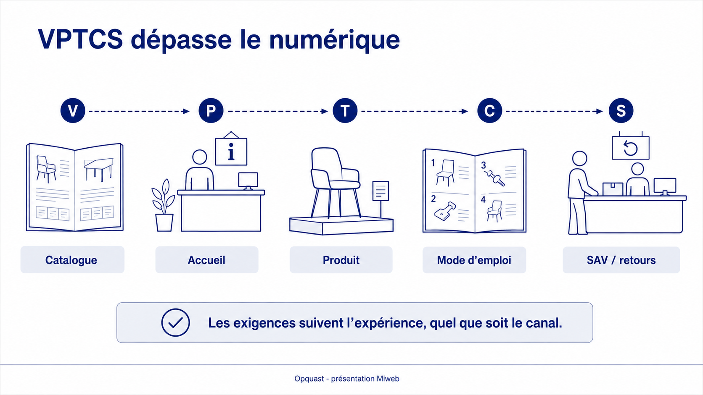

Origine : [2026-09-04-opquast-vptcs-compagnon, slide 17](../assets/slides/slide-29.png). Correspondance vérifiée : pixels RGBA identiques.

### Prompt disponible

Consignes conservées dans le [storyboard source](origines/2026-09-04-opquast-vptcs-compagnon/storyboard-vptcs.md), section de la slide 17 (ligne 176). L’[export des prompts](origines/2026-09-04-opquast-vptcs-compagnon/imagegen-prompts-export.txt) ne permet pas de retrouver l’appel original exact.

```text
MASQUE COMMUN — extrait du storyboard

- Format : 16:9 paysage, image PNG projetable.
- Fond blanc, bleu profond `#001070`, gris froid `#F2F3F7`, rouge réservé aux alertes.
- Titre aligné en haut à gauche, sans numérotation visible.
- Pictogrammes filaires bleus, scènes concrètes, flèches uniquement lorsqu’elles portent une relation.
- Texte visible très condensé : trois à six labels courts et un seul message central.
- Callout bleu ou gris froid centré en bas, jamais rouge.
- Pied de page exact : `Opquast - présentation Miweb`.
- Aucun logo inventé, blason, photographie, dégradé, effet 3D ou texte parasite.

CONTRAT DE LA SLIDE SOURCE 17 — VPTCS dépasse le numérique

- Rôle : ouvrir le modèle aux services physiques.
- Scène : un parcours d’achat ou de service physique relie catalogue, accueil, produit, mode d’emploi puis SAV.
- Transformation : les mêmes attentes traversent le numérique et le monde physique.
- Texte visible : `Catalogue`, `Accueil`, `Produit`, `Mode d’emploi`, `SAV / retours`.
- Callout : `Les exigences suivent l’expérience, quel que soit le canal.`
- Risque : limiter VPTCS aux interfaces web.
```

### Notes du présentateur

```text
Le modèle peut lire une expérience qui combine supports numériques, produits et services physiques.

Le corpus propose les correspondances suivantes :

- Visibilité : où trouver, catalogues.
- Perception : ergo-design.
- Technique : spécifications techniques.
- Contenus : mode d’emploi, instructions et montage.
- Services : SAV et retours.

Le modèle suit donc les exigences utilisateurs au-delà de la seule interface web.
```

Source : `ppt/notesSlides/notesSlide29.xml`, lié à la slide 29 dans le PPTX fourni.

---

<a id="slide-30"></a>

## Slide 30 — Une règle a quatre éléments

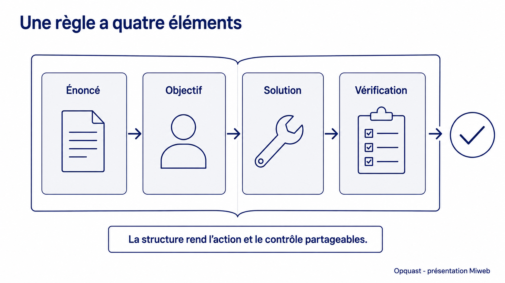

Origine : [Critères de fabrication des règles, slide 39](../assets/slides/slide-30.png). Correspondance vérifiée : fichier PNG identique.

### Prompt disponible

Consignes conservées dans le [storyboard source](origines/2026-09-05-opquast-formation-criteres-regles-prolongation/storyboard-pds.md), section de la slide 39 (ligne 98). L’[export des prompts](origines/2026-09-05-opquast-formation-criteres-regles-prolongation/imagegen-prompts-export.txt) ne permet pas de retrouver l’appel original exact.

```text
MASQUE COMMUN — extrait du storyboard

- Format : image finale 16:9, nouvelles slides en 1672 × 941 px, puis PPTX
  plein écran 16:9 ; la slide 27 héritée mesure 1673 × 940 px.
- Fond blanc, bleu profond `#001070`, panneaux gris très clair `#F2F3F7`.
- Rouge `#E44850` uniquement pour une réserve ou une condition à éviter.
- Typographie visible : Marianne, Arial comme fallback explicite.
- Titre en haut à gauche, sans numéro visible.
- Trois à cinq labels courts par slide, une seule tension ou transformation.
- Callout centré en bas, bleu ou gris, jamais rouge.
- Pied de page exact : `Opquast - présentation Miweb`.
- Aucun logo inventé, blason, photo, dégradé, 3D, effet décoratif ou texte
  parasite.

CONTRAT DE LA SLIDE SOURCE 39 — Une règle a quatre éléments

- Scène : une fiche ouverte montre quatre zones qui convergent vers une coche de
  contrôle.
- Transformation : état constaté → bénéfice → mise en œuvre → verdict.
- Texte exact : `Énoncé`, `Objectif`, `Solution`, `Vérification`.
- Callout : `La structure rend l’action et le contrôle partageables.`
- Ce que l’image seule doit montrer : chaque partie de la fiche joue un rôle
  différent.
- Contraintes critiques : conserver l’ordre et les quatre libellés exacts ;
  l’énoncé décrit un état, pas un conseil.
```

### Notes du présentateur

```text
Chaque règle porte quatre éléments exploitables directement :

L’énoncé décrit un état constatable, pas un conseil. 
L’objectif explique le bénéfice attendu pour l’utilisateur. 
La solution indique comment mettre la règle en œuvre. 
La vérification décrit comment produire le verdict. 

C'est ce quatrième point qui rend le référentiel opposable : deux personnes qui appliquent la même vérification arrivent au même verdict.

Insister sur la vérification. C'est le pivot de la première partie.
```

Source : `ppt/notesSlides/notesSlide30.xml`, lié à la slide 30 dans le PPTX fourni.

---

<a id="slide-31"></a>

## Slide 31 — Une règle commence par un problème utilisateur

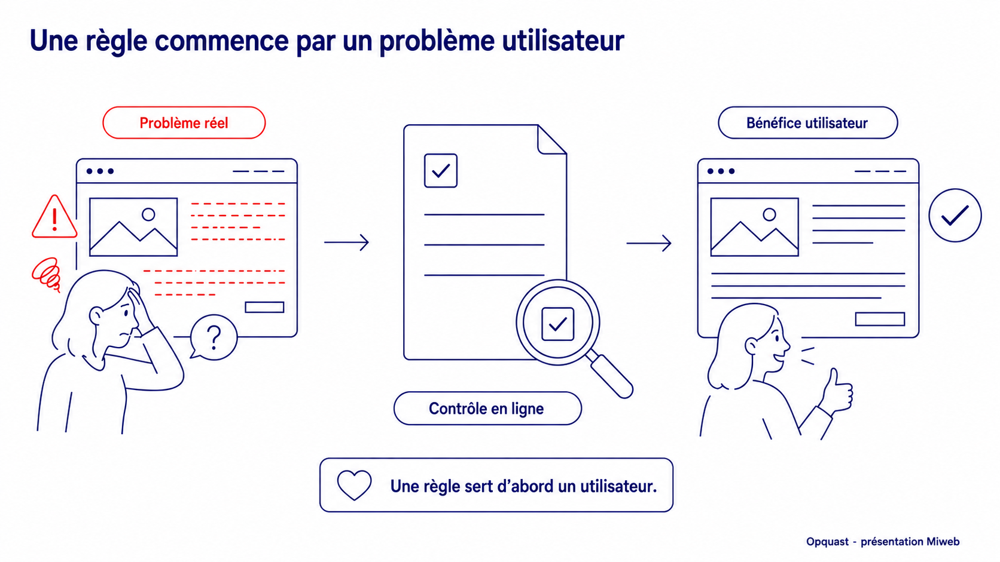

Origine : [Critères de fabrication des règles, slide 35](../assets/slides/slide-31.png). Correspondance vérifiée : fichier PNG identique.

### Prompt disponible

Consignes conservées dans le [storyboard source](origines/2026-09-05-opquast-formation-criteres-regles-prolongation/storyboard-pds.md), section de la slide 35 (ligne 45). L’[export des prompts](origines/2026-09-05-opquast-formation-criteres-regles-prolongation/imagegen-prompts-export.txt) ne permet pas de retrouver l’appel original exact.

```text
MASQUE COMMUN — extrait du storyboard

- Format : image finale 16:9, nouvelles slides en 1672 × 941 px, puis PPTX
  plein écran 16:9 ; la slide 27 héritée mesure 1673 × 940 px.
- Fond blanc, bleu profond `#001070`, panneaux gris très clair `#F2F3F7`.
- Rouge `#E44850` uniquement pour une réserve ou une condition à éviter.
- Typographie visible : Marianne, Arial comme fallback explicite.
- Titre en haut à gauche, sans numéro visible.
- Trois à cinq labels courts par slide, une seule tension ou transformation.
- Callout centré en bas, bleu ou gris, jamais rouge.
- Pied de page exact : `Opquast - présentation Miweb`.
- Aucun logo inventé, blason, photo, dégradé, 3D, effet décoratif ou texte
  parasite.

CONTRAT DE LA SLIDE SOURCE 35 — Une règle commence par un problème utilisateur

- Scène : une personne bute sur une interface et une équipe transforme la
  difficulté en point de contrôle.
- Transformation : difficulté vécue → bénéfice identifiable → contrôle en
  ligne.
- Texte exact : `Problème réel`, `Bénéfice utilisateur`, `Contrôle en ligne`.
- Callout : `Une règle sert d’abord un utilisateur.`
- Ce que l’image seule doit montrer : une règle relie une gêne concrète à un
  contrôle observable.
- Contraintes critiques : conserver les critères utile et vérifiable en ligne ;
  ne pas montrer un conseil vague ni une mesure inventée.
```

### Notes du présentateur

```text
Penser à une difficulté réelle rencontrée par un utilisateur. 

Faire préciser le bénéfice attendu avant de parler de solution.

La règle doit ensuite permettre un contrôle concret en ligne. Elle ne se réduit donc ni à une intention ni à une bonne pratique générale.

Interaction

Quel problème utilisateur cette règle cherche-t-elle à éviter ?
Rappeler que l’erreur de formulation est normale avant de reformuler ensemble.
```

Source : `ppt/notesSlides/notesSlide31.xml`, lié à la slide 31 dans le PPTX fourni.

---

<a id="slide-32"></a>

## Slide 32 — Une règle pose une seule question

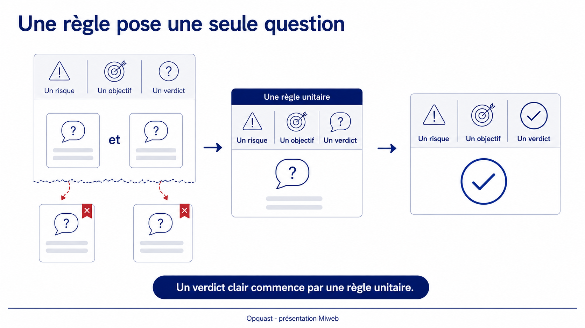

Origine : [Critères de fabrication des règles, slide 36](../assets/slides/slide-32.png). Correspondance vérifiée : fichier PNG identique.

### Prompt disponible

Consignes conservées dans le [storyboard source](origines/2026-09-05-opquast-formation-criteres-regles-prolongation/storyboard-pds.md), section de la slide 36 (ligne 58). L’[export des prompts](origines/2026-09-05-opquast-formation-criteres-regles-prolongation/imagegen-prompts-export.txt) ne permet pas de retrouver l’appel original exact.

```text
MASQUE COMMUN — extrait du storyboard

- Format : image finale 16:9, nouvelles slides en 1672 × 941 px, puis PPTX
  plein écran 16:9 ; la slide 27 héritée mesure 1673 × 940 px.
- Fond blanc, bleu profond `#001070`, panneaux gris très clair `#F2F3F7`.
- Rouge `#E44850` uniquement pour une réserve ou une condition à éviter.
- Typographie visible : Marianne, Arial comme fallback explicite.
- Titre en haut à gauche, sans numéro visible.
- Trois à cinq labels courts par slide, une seule tension ou transformation.
- Callout centré en bas, bleu ou gris, jamais rouge.
- Pied de page exact : `Opquast - présentation Miweb`.
- Aucun logo inventé, blason, photo, dégradé, 3D, effet décoratif ou texte
  parasite.

CONTRAT DE LA SLIDE SOURCE 36 — Une règle pose une seule question

- Scène : une fiche de règle est séparée en une seule question, un seul risque
  et un verdict binaire ; le mot `et` reliant deux obligations est marqué en
  réserve.
- Transformation : règle composée → exigences séparées → verdict non ambigu.
- Texte exact : `Un risque`, `Un objectif`, `Un verdict`.
- Callout : `Un verdict clair commence par une règle unitaire.`
- Ce que l’image seule doit montrer : l’évaluateur sait exactement ce qu’il
  doit contrôler.
- Contraintes critiques : conserver unitaire et non ambiguë ; ne pas interdire
  le mot « et » dans une phrase ordinaire, seulement signaler deux conditions
  indépendantes dans une même règle.
```

### Notes du présentateur

```text
Une règle unitaire porte sur un seul risque, un seul objectif ou une seule question. 

Deux évaluateurs doivent pouvoir aboutir au même verdict. 

Le point de vigilance concerne les exigences indépendantes assemblées dans une même phrase, pas l’interdiction du mot « et » dans le langage courant.
```

Source : `ppt/notesSlides/notesSlide32.xml`, lié à la slide 32 dans le PPTX fourni.

---

<a id="slide-33"></a>

## Slide 33 — Une règle doit rester claire et applicable


Origine : [Critères de fabrication des règles, slide 37](../assets/slides/slide-33.png). Correspondance vérifiée : fichier PNG identique.

### Prompt disponible

Consignes conservées dans le [storyboard source](origines/2026-09-05-opquast-formation-criteres-regles-prolongation/storyboard-pds.md), section de la slide 37 (ligne 72). L’[export des prompts](origines/2026-09-05-opquast-formation-criteres-regles-prolongation/imagegen-prompts-export.txt) ne permet pas de retrouver l’appel original exact.

```text
MASQUE COMMUN — extrait du storyboard

- Format : image finale 16:9, nouvelles slides en 1672 × 941 px, puis PPTX
  plein écran 16:9 ; la slide 27 héritée mesure 1673 × 940 px.
- Fond blanc, bleu profond `#001070`, panneaux gris très clair `#F2F3F7`.
- Rouge `#E44850` uniquement pour une réserve ou une condition à éviter.
- Typographie visible : Marianne, Arial comme fallback explicite.
- Titre en haut à gauche, sans numéro visible.
- Trois à cinq labels courts par slide, une seule tension ou transformation.
- Callout centré en bas, bleu ou gris, jamais rouge.
- Pied de page exact : `Opquast - présentation Miweb`.
- Aucun logo inventé, blason, photo, dégradé, 3D, effet décoratif ou texte
  parasite.

CONTRAT DE LA SLIDE SOURCE 37 — Une règle doit rester claire et applicable

- Scène : la même fiche passe trois postes de lecture : plusieurs
  professionnels la comprennent, plusieurs contextes peuvent l’utiliser, une
  équipe peut la mettre en œuvre.
- Transformation : formulation obscure → formulation claire → usage réaliste.
- Texte exact : `Claire`, `Universelle`, `Réaliste`.
- Callout : `Une règle doit survivre au changement de contexte.`
- Ce que l’image seule doit montrer : la règle passe de l’écriture à la mise en
  œuvre sans dépendre d’un pays ni d’un service particulier.
- Contraintes critiques : ne pas confondre universelle avec « identique partout » ;
  conserver claire, précise, simple, universelle et réaliste dans les notes.
```

### Notes du présentateur

```text
La règle doit être comprise par des professionnels différents. 

Elle ne doit pas dépendre d’un pays, d’une législation nationale ou d’un contexte local. 

Elle doit aussi pouvoir être mise en œuvre sur une grande variété de services numériques. 

« Universelle » signifie donc transférable, pas identique en toute circonstance.

Une règle peut être simple à lire tout en restant assez précise pour produire un contrôle commun.
```

Source : `ppt/notesSlides/notesSlide33.xml`, lié à la slide 33 dans le PPTX fourni.

---

<a id="slide-34"></a>

## Slide 34 — Une règle doit durer et rassembler

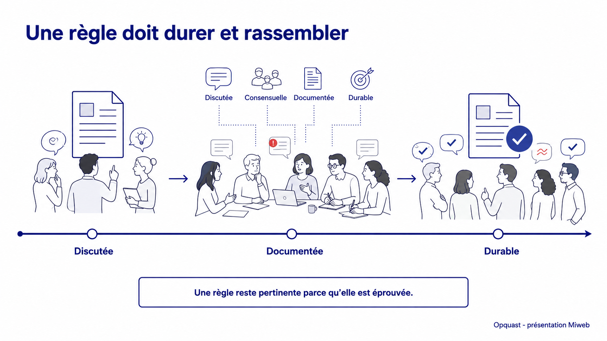

Origine : [Critères de fabrication des règles, slide 38](../assets/slides/slide-34.png). Correspondance vérifiée : fichier PNG identique.

### Prompt disponible

Consignes conservées dans le [storyboard source](origines/2026-09-05-opquast-formation-criteres-regles-prolongation/storyboard-pds.md), section de la slide 38 (ligne 85). L’[export des prompts](origines/2026-09-05-opquast-formation-criteres-regles-prolongation/imagegen-prompts-export.txt) ne permet pas de retrouver l’appel original exact.

```text
MASQUE COMMUN — extrait du storyboard

- Format : image finale 16:9, nouvelles slides en 1672 × 941 px, puis PPTX
  plein écran 16:9 ; la slide 27 héritée mesure 1673 × 940 px.
- Fond blanc, bleu profond `#001070`, panneaux gris très clair `#F2F3F7`.
- Rouge `#E44850` uniquement pour une réserve ou une condition à éviter.
- Typographie visible : Marianne, Arial comme fallback explicite.
- Titre en haut à gauche, sans numéro visible.
- Trois à cinq labels courts par slide, une seule tension ou transformation.
- Callout centré en bas, bleu ou gris, jamais rouge.
- Pied de page exact : `Opquast - présentation Miweb`.
- Aucun logo inventé, blason, photo, dégradé, 3D, effet décoratif ou texte
  parasite.

CONTRAT DE LA SLIDE SOURCE 38 — Une règle doit durer et rassembler

- Scène : une fiche de règle traverse une ligne du temps et une table de revue ;
  des contributeurs discutent, documentent puis valident une version stable.
- Transformation : proposition → discussion → consensus → règle durable.
- Texte exact : `Discutée`, `Consensuelle`, `Durable`, `Documentée`.
- Callout : `Une règle reste pertinente parce qu’elle est éprouvée.`
- Ce que l’image seule doit montrer : la durée dépend de la pertinence, de la
  documentation et de l’adhésion collective.
- Contraintes critiques : ne pas représenter l’unanimité comme nécessaire ; ne
  pas afficher de date d’expiration ; conserver l’idée de durabilité jusqu’à
  l’horizon 2030 dans les notes.
```

### Notes du présentateur

```text
 Passage sur la durabilité : une règle doit rester pertinente et vérifiable dans le temps, sans date d’expiration.

La discussion sert à trouver les ambiguïtés, les cas limites et les difficultés d’application. 

Le consensus ne signifie pas l’unanimité : il signifie qu’une adhésion suffisamment large existe et qu’aucune objection majeure ne reste sans
réponse. 

La documentation permet de conserver le raisonnement et de défendre la règle dans le temps.
```

Source : `ppt/notesSlides/notesSlide34.xml`, lié à la slide 34 dans le PPTX fourni.

---

<a id="slide-35"></a>

## Slide 35 — Une règle passe cinq questions

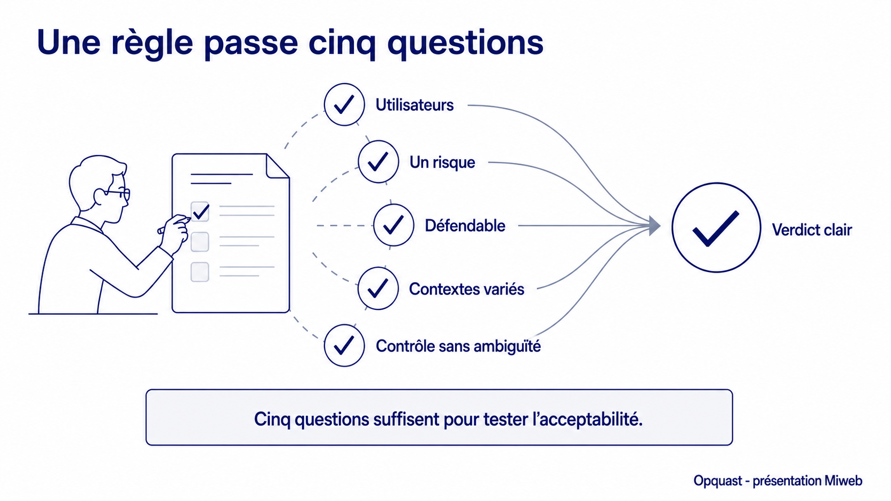

Origine : [Critères de fabrication des règles, slide 40](../assets/slides/slide-35.png). Correspondance vérifiée : fichier PNG identique.

### Prompt disponible

Consignes conservées dans le [storyboard source](origines/2026-09-05-opquast-formation-criteres-regles-prolongation/storyboard-pds.md), section de la slide 40 (ligne 110). L’[export des prompts](origines/2026-09-05-opquast-formation-criteres-regles-prolongation/imagegen-prompts-export.txt) ne permet pas de retrouver l’appel original exact.

```text
MASQUE COMMUN — extrait du storyboard

- Format : image finale 16:9, nouvelles slides en 1672 × 941 px, puis PPTX
  plein écran 16:9 ; la slide 27 héritée mesure 1673 × 940 px.
- Fond blanc, bleu profond `#001070`, panneaux gris très clair `#F2F3F7`.
- Rouge `#E44850` uniquement pour une réserve ou une condition à éviter.
- Typographie visible : Marianne, Arial comme fallback explicite.
- Titre en haut à gauche, sans numéro visible.
- Trois à cinq labels courts par slide, une seule tension ou transformation.
- Callout centré en bas, bleu ou gris, jamais rouge.
- Pied de page exact : `Opquast - présentation Miweb`.
- Aucun logo inventé, blason, photo, dégradé, 3D, effet décoratif ou texte
  parasite.

CONTRAT DE LA SLIDE SOURCE 40 — Une règle passe cinq questions

- Scène : un évaluateur pose cinq tampons sur une même fiche, puis obtient un
  verdict clair.
- Transformation : intuition → questions communes → décision défendable.
- Texte exact : `Utilisateurs`, `Un risque`, `Verdict clair`, `Contextes variés`,
  `Défendable`.
- Callout : `Cinq questions suffisent pour tester l’acceptabilité.`
- Ce que l’image seule doit montrer : l’acceptation repose sur cinq contrôles
  distincts.
- Contraintes critiques : conserver le sens exact des cinq questions du corpus ;
  ne pas transformer le verdict en score numérique.
```

### Notes du présentateur

```text
Les cinq questions minimales portent sur 

 l’utilité pour les utilisateurs, 
 l’unicité du risque, 
 l’absence d’ambiguïté du contrôle, 
 l’applicabilité dans des contextes variés 
 et la possibilité de défendre et documenter la règle.

Elles ne constituent pas un score numérique. 
Elles servent de filtre de qualité avant de poursuivre la discussion.
```

Source : `ppt/notesSlides/notesSlide35.xml`, lié à la slide 35 dans le PPTX fourni.

---

<a id="slide-36"></a>

## Slide 36 — La règle se construit à plusieurs


Origine : [Critères de fabrication des règles, slide 41](../assets/slides/slide-36.png). Correspondance vérifiée : fichier PNG identique.

### Prompt disponible

Consignes conservées dans le [storyboard source](origines/2026-09-05-opquast-formation-criteres-regles-prolongation/storyboard-pds.md), section de la slide 41 (ligne 123). L’[export des prompts](origines/2026-09-05-opquast-formation-criteres-regles-prolongation/imagegen-prompts-export.txt) ne permet pas de retrouver l’appel original exact.

```text
MASQUE COMMUN — extrait du storyboard

- Format : image finale 16:9, nouvelles slides en 1672 × 941 px, puis PPTX
  plein écran 16:9 ; la slide 27 héritée mesure 1673 × 940 px.
- Fond blanc, bleu profond `#001070`, panneaux gris très clair `#F2F3F7`.
- Rouge `#E44850` uniquement pour une réserve ou une condition à éviter.
- Typographie visible : Marianne, Arial comme fallback explicite.
- Titre en haut à gauche, sans numéro visible.
- Trois à cinq labels courts par slide, une seule tension ou transformation.
- Callout centré en bas, bleu ou gris, jamais rouge.
- Pied de page exact : `Opquast - présentation Miweb`.
- Aucun logo inventé, blason, photo, dégradé, 3D, effet décoratif ou texte
  parasite.

CONTRAT DE LA SLIDE SOURCE 41 — La règle se construit à plusieurs

- Scène : une proposition circule entre contributeurs, reçoit des commentaires,
  devient une version candidate, puis une formulation relue et validée.
- Transformation : problème utilisateur → état observable → discussion →
  reformulation → validation.
- Texte exact : `Problème`, `État observable`, `Discussion`, `Reformulation`,
  `Validation`.
- Callout : `Le consensus améliore la précision sans exiger l’unanimité.`
- Ce que l’image seule doit montrer : la règle gagne en précision par itérations
  documentées.
- Contraintes critiques : garder les huit étapes du corpus dans les notes ;
  rappeler que la grille V5 est une synthèse non officielle ; ne pas inventer de
  procédure de vote.
```

### Notes du présentateur

```text
Le processus part d’un problème utilisateur, formule un état observable, sépare l’énoncé, l’objectif, la solution et le contrôle, puis soumet la
proposition aux contributeurs. 

Les discussions recherchent les ambiguïtés et les cas limites. 

La formulation est ensuite réécrite en conservant le sens et la compréhension, avant une validation, une fusion ou une suppression selon
l’utilité, la faisabilité, la vérifiabilité et le consensus.

Point de vigilance

Ne pas présenter la scène comme une procédure de vote formelle. Elle montre un travail de discussion et de reformulation documenté.
```

Source : `ppt/notesSlides/notesSlide36.xml`, lié à la slide 36 dans le PPTX fourni.

---

<a id="slide-37"></a>

## Slide 37 — Règle 69, l'étiquette de formulaire

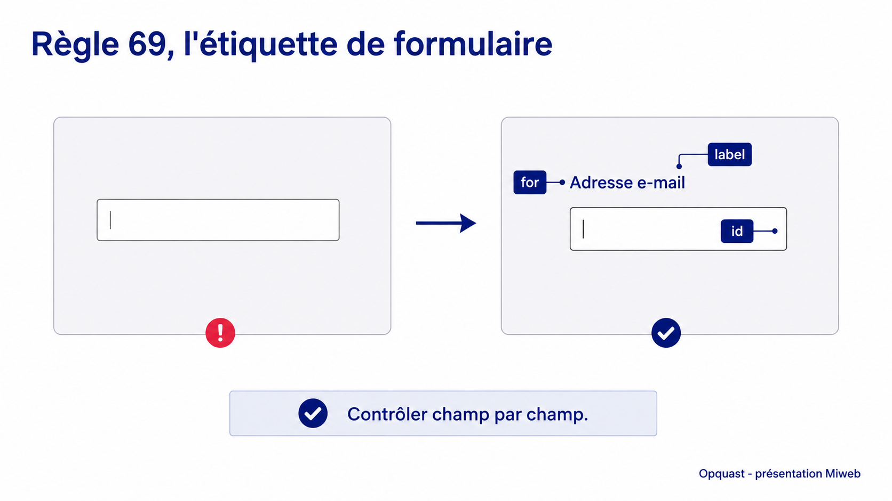

Origine : [2026-09-04-opquast-formation-miweb, slide 10](../assets/slides/slide-37.png). Correspondance vérifiée : fichier PNG identique.

### Prompt disponible

Consignes conservées dans le [storyboard source](origines/2026-09-04-opquast-formation-miweb/storyboard-pds.md), section de la slide 10 (ligne 139). L’[export des prompts](origines/2026-09-04-opquast-formation-miweb/imagegen-prompts-export.txt) ne permet pas de retrouver l’appel original exact.

```text
MASQUE COMMUN — extrait du storyboard

- Format : image finale 16:9, 1600 x 900 px.
- Fond : blanc.
- Structure : bleu nuit institutionnel `#001070`, panneaux gris froid `#F2F3F7`, rouge de contrôle `#E44850` uniquement pour un risque, une alerte ou un point à confirmer.
- Typographie visible : Marianne ; Arial seulement comme fallback explicite.
- Titre : haut gauche, casse de phrase, sans numéro visible.
- Footer : `Opquast - présentation Miweb`, discret en bas à droite.
- Formes : scènes concrètes, objets-systèmes, diagrammes plats, traits fins, flèches logiques, aucun faux logo ou emblème.
- Callout : phrase courte, stable en bas, bleu ou gris froid, jamais rouge.

CONTRAT DE LA SLIDE SOURCE 10 — Règle 69, l'étiquette de formulaire

- Étape : exemple concret de développement.
- Idée principale : chaque champ doit être associé à sa propre étiquette dans le code.
- Idée observable : un formulaire passe d'un champ sans nom à un champ relié par `label`, `for` et `id`.
- Forme visuelle : avant / après technique.
- Visuel seul : la relation entre l'étiquette et le champ devient visible.
- Libellés : `Champ`, `label`, `for`, `id`, `Vérifier`.
- Phrase à retenir : `Contrôler champ par champ.`
- Ajout : applique l'anatomie à une règle.
- Prépare : un autre exemple d'accessibilité.
- Contraintes critiques : titre exact ; ne pas inverser `for` et `id` ; conserver la gravité critique, les dimensions Basics et Accessibilité et la phase Développement dans les notes.
```

### Notes du présentateur

```text
« Chaque champ de formulaire est associé dans le code source à une étiquette qui lui est propre. »

Rubrique Formulaires, gravité critique, dimensions Basics et Accessibilité, phase Développement.
Solution : un élément `label` doté d'un attribut `for` reprenant l'`id` du champ, ou une alternative explicite si l'étiquette n'est pas visible.
Vérification : contrôler dans le code source la correspondance entre `for` et `id`, champ par champ.
```

Source : `ppt/notesSlides/notesSlide37.xml`, lié à la slide 37 dans le PPTX fourni.

---

<a id="slide-38"></a>

## Slide 38 — Règle 165, le focus clavier

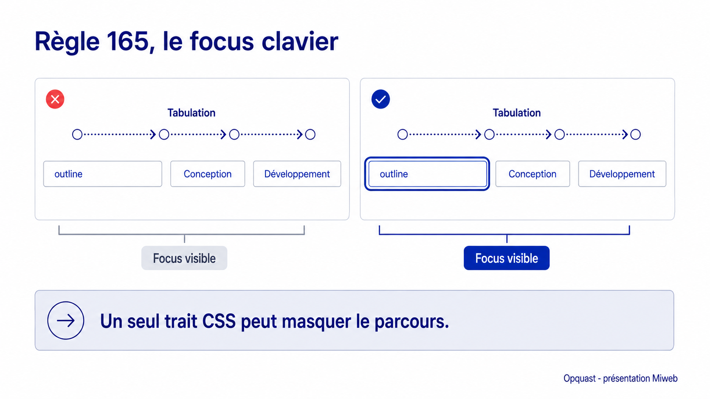

Origine : [2026-09-04-opquast-formation-miweb, slide 11](../assets/slides/slide-38.png). Correspondance vérifiée : fichier PNG identique.

### Prompt disponible

Consignes conservées dans le [storyboard source](origines/2026-09-04-opquast-formation-miweb/storyboard-pds.md), section de la slide 11 (ligne 151). L’[export des prompts](origines/2026-09-04-opquast-formation-miweb/imagegen-prompts-export.txt) ne permet pas de retrouver l’appel original exact.

```text
MASQUE COMMUN — extrait du storyboard

- Format : image finale 16:9, 1600 x 900 px.
- Fond : blanc.
- Structure : bleu nuit institutionnel `#001070`, panneaux gris froid `#F2F3F7`, rouge de contrôle `#E44850` uniquement pour un risque, une alerte ou un point à confirmer.
- Typographie visible : Marianne ; Arial seulement comme fallback explicite.
- Titre : haut gauche, casse de phrase, sans numéro visible.
- Footer : `Opquast - présentation Miweb`, discret en bas à droite.
- Formes : scènes concrètes, objets-systèmes, diagrammes plats, traits fins, flèches logiques, aucun faux logo ou emblème.
- Callout : phrase courte, stable en bas, bleu ou gris froid, jamais rouge.

CONTRAT DE LA SLIDE SOURCE 11 — Règle 165, le focus clavier

- Étape : exemple concret de conception et développement.
- Idée principale : le focus clavier doit rester visible.
- Idée observable : un parcours à la touche Tab montre un anneau de focus visible ; une suppression de `outline` est barrée.
- Forme visuelle : chemin avec point de contrôle.
- Visuel seul : le clavier avance et l'élément actif reste repérable.
- Libellés : `Tabulation`, `Focus visible`, `outline`, `Conception`, `Développement`.
- Phrase à retenir : `Un seul trait CSS peut masquer le parcours.`
- Ajout : montre une violation fréquente et contrôlable.
- Prépare : le modèle utilisateur VPTCS.
- Contraintes critiques : titre exact ; ne pas montrer un focus masqué comme état final.
```

### Notes du présentateur

```text
« Le focus clavier n'est ni supprimé ni masqué. »

Rubrique Navigation, gravité critique, dimensions Basics et Accessibilité, phases Conception et Développement.

Solution : ne pas annuler la propriété CSS `outline` sans lui substituer un indicateur visible.

Vérification : parcourir tous les éléments interactifs à la touche de tabulation.
```

Source : `ppt/notesSlides/notesSlide38.xml`, lié à la slide 38 dans le PPTX fourni.

---

<a id="slide-39"></a>

## Slide 39 — La certification, ce qu'elle est

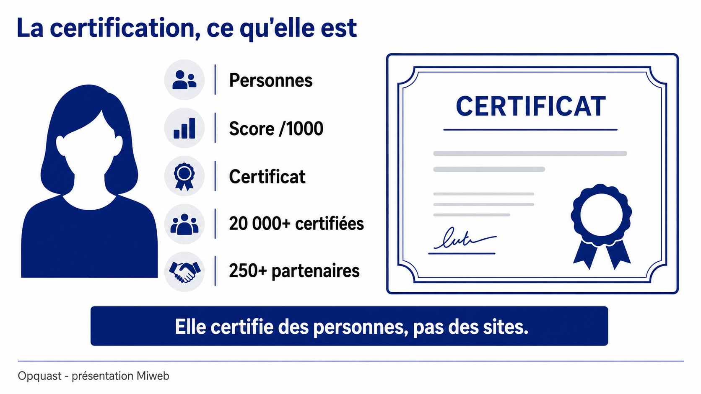

Origine : [2026-09-04-opquast-formation-miweb, slide 21](../assets/slides/slide-39.png). Correspondance vérifiée : fichier PNG identique.

### Prompt disponible

Consignes conservées dans le [storyboard source](origines/2026-09-04-opquast-formation-miweb/storyboard-pds.md), section de la slide 21 (ligne 271). L’[export des prompts](origines/2026-09-04-opquast-formation-miweb/imagegen-prompts-export.txt) ne permet pas de retrouver l’appel original exact.

```text
MASQUE COMMUN — extrait du storyboard

- Format : image finale 16:9, 1600 x 900 px.
- Fond : blanc.
- Structure : bleu nuit institutionnel `#001070`, panneaux gris froid `#F2F3F7`, rouge de contrôle `#E44850` uniquement pour un risque, une alerte ou un point à confirmer.
- Typographie visible : Marianne ; Arial seulement comme fallback explicite.
- Titre : haut gauche, casse de phrase, sans numéro visible.
- Footer : `Opquast - présentation Miweb`, discret en bas à droite.
- Formes : scènes concrètes, objets-systèmes, diagrammes plats, traits fins, flèches logiques, aucun faux logo ou emblème.
- Callout : phrase courte, stable en bas, bleu ou gris froid, jamais rouge.

CONTRAT DE LA SLIDE SOURCE 21 — La certification, ce qu'elle est

- Étape : entrée dans la certification.
- Idée principale : la certification mesure la maîtrise d'une personne.
- Idée observable : une personne reçoit un certificat lié à son nom, son score sur 1000 et une référence.
- Forme visuelle : fiche de certification.
- Visuel seul : le certificat est personnel et mesuré.
- Libellés : `Personnes`, `Score /1000`, `Certificat`, `20 000+ certifiées`, `250+ partenaires`.
- Phrase à retenir : `Opquast certifie une personne, pas un site.`
- Ajout : clarifie l'objet de la certification.
- Prépare : le parcours de formation.
- Contraintes critiques : ne pas afficher un site certifié ; conserver les chiffres comme revendications sourcées dans les notes.
```

### Notes du présentateur

```text
Les modalités concrètes de la certification. 

La certification s'intitule « Maîtrise de la qualité en projet web ».

Elle porte sur des personnes, jamais sur des sites ni sur des prestataires. Elle donne un score sur 1000, et non une simple mention réussite ou échec. Le score, la référence du certificat et le nom du certifié sont indissociables.

Opquast revendique plus de 20 000 personnes certifiées et plus de 250 partenaires.

Le point « elle certifie des personnes » évite un malentendu fréquent : on ne peut pas afficher un site certifié Opquast.
```

Source : `ppt/notesSlides/notesSlide39.xml`, lié à la slide 39 dans le PPTX fourni.

---

<a id="slide-40"></a>

## Slide 40 — La formation, 12 à 14 heures en ligne

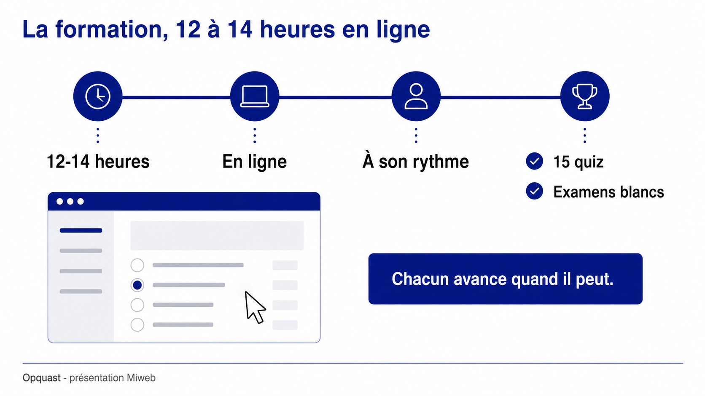

Origine : [2026-09-04-opquast-formation-miweb, slide 22](../assets/slides/slide-40.png). Correspondance vérifiée : fichier PNG identique.

### Prompt disponible

Consignes conservées dans le [storyboard source](origines/2026-09-04-opquast-formation-miweb/storyboard-pds.md), section de la slide 22 (ligne 283). L’[export des prompts](origines/2026-09-04-opquast-formation-miweb/imagegen-prompts-export.txt) ne permet pas de retrouver l’appel original exact.

```text
MASQUE COMMUN — extrait du storyboard

- Format : image finale 16:9, 1600 x 900 px.
- Fond : blanc.
- Structure : bleu nuit institutionnel `#001070`, panneaux gris froid `#F2F3F7`, rouge de contrôle `#E44850` uniquement pour un risque, une alerte ou un point à confirmer.
- Typographie visible : Marianne ; Arial seulement comme fallback explicite.
- Titre : haut gauche, casse de phrase, sans numéro visible.
- Footer : `Opquast - présentation Miweb`, discret en bas à droite.
- Formes : scènes concrètes, objets-systèmes, diagrammes plats, traits fins, flèches logiques, aucun faux logo ou emblème.
- Callout : phrase courte, stable en bas, bleu ou gris froid, jamais rouge.

CONTRAT DE LA SLIDE SOURCE 22 — La formation, 12 à 14 heures en ligne

- Étape : préparation.
- Idée principale : le parcours officiel se fait en ligne, à son rythme, avec entraînement.
- Idée observable : une personne avance sur une plateforme, traverse quinze quiz et des examens blancs.
- Forme visuelle : chronologie de formation.
- Visuel seul : le travail est asynchrone et structuré.
- Libellés : `12-14 heures`, `En ligne`, `15 quiz`, `Examens blancs`.
- Phrase à retenir : `Le parcours prépare l'examen.`
- Ajout : explique l'effort demandé.
- Prépare : les conditions d'accès.
- Contraintes critiques : conserver la fourchette 12 à 14 heures et les quinze quiz.
```

### Notes du présentateur

```text
Le parcours se fait sur la plateforme officielle, à son rythme, et représente entre 12 et 14 heures de travail.

Il combine des contenus, quinze quiz auto-correctifs et des examens blancs, qui servent à la fois d'entraînement et de conditions d'accès à l'examen.

Insister sur le format asynchrone : chacun avance quand il peut, seule façon réaliste de dégager 14 heures.
```

Source : `ppt/notesSlides/notesSlide40.xml`, lié à la slide 40 dans le PPTX fourni.

---

<a id="slide-41"></a>

## Slide 41 — Les trois conditions pour accéder à l'examen

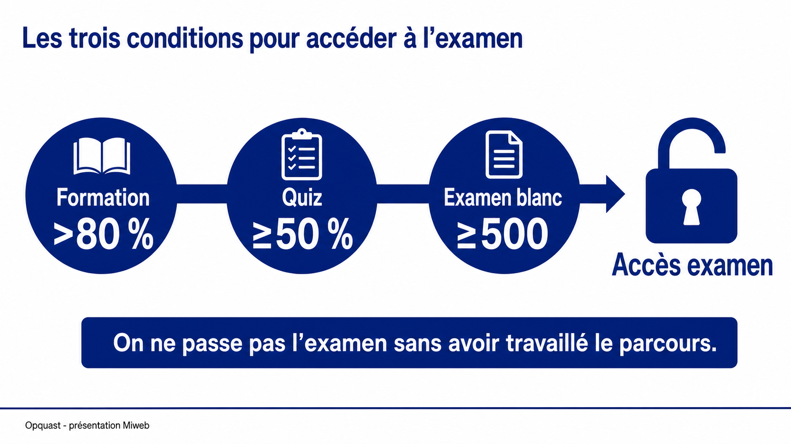

Origine : [2026-09-04-opquast-formation-miweb, slide 23](../assets/slides/slide-41.png). Correspondance vérifiée : fichier PNG identique.

### Prompt disponible

Consignes conservées dans le [storyboard source](origines/2026-09-04-opquast-formation-miweb/storyboard-pds.md), section de la slide 23 (ligne 295). L’[export des prompts](origines/2026-09-04-opquast-formation-miweb/imagegen-prompts-export.txt) ne permet pas de retrouver l’appel original exact.

```text
MASQUE COMMUN — extrait du storyboard

- Format : image finale 16:9, 1600 x 900 px.
- Fond : blanc.
- Structure : bleu nuit institutionnel `#001070`, panneaux gris froid `#F2F3F7`, rouge de contrôle `#E44850` uniquement pour un risque, une alerte ou un point à confirmer.
- Typographie visible : Marianne ; Arial seulement comme fallback explicite.
- Titre : haut gauche, casse de phrase, sans numéro visible.
- Footer : `Opquast - présentation Miweb`, discret en bas à droite.
- Formes : scènes concrètes, objets-systèmes, diagrammes plats, traits fins, flèches logiques, aucun faux logo ou emblème.
- Callout : phrase courte, stable en bas, bleu ou gris froid, jamais rouge.

CONTRAT DE LA SLIDE SOURCE 23 — Les trois conditions pour accéder à l'examen

- Étape : porte d'accès.
- Idée principale : trois seuils doivent être franchis avant l'examen.
- Idée observable : trois portes successives s'ouvrent avec `>80 %`, `≥50 %`, `≥500`.
- Forme visuelle : portes de décision.
- Visuel seul : l'accès est conditionné par trois preuves.
- Libellés : `Formation >80 %`, `Quiz ≥50 %`, `Examen blanc ≥500`.
- Phrase à retenir : `L'examen s'ouvre après ces trois seuils.`
- Ajout : donne la règle d'organisation.
- Prépare : le jour de l'examen.
- Contraintes critiques : garder les trois seuils exacts et leur ordre logique ; les quinze quiz concernent la condition de 50 % à chacun.
```

### Notes du présentateur

```text
L'examen ne s'ouvre pas tant que ces trois seuils ne sont pas atteints :

- avoir réalisé plus de 80 % de la formation ;
- avoir obtenu au moins 50 % à chacun des quinze quiz ;
- avoir obtenu au moins 500 points à l'un des examens blancs.

Personne ne passe l'examen sans avoir travaillé le parcours. Conséquence pratique : planifier les 14 heures, pas les improviser la veille.
```

Source : `ppt/notesSlides/notesSlide41.xml`, lié à la slide 41 dans le PPTX fourni.

---

<a id="slide-42"></a>

## Slide 42 — Le jour de l'examen


Origine : [2026-09-04-opquast-formation-miweb, slide 24](../assets/slides/slide-42.png). Correspondance vérifiée : fichier PNG identique.

### Prompt disponible

Consignes conservées dans le [storyboard source](origines/2026-09-04-opquast-formation-miweb/storyboard-pds.md), section de la slide 24 (ligne 307). L’[export des prompts](origines/2026-09-04-opquast-formation-miweb/imagegen-prompts-export.txt) ne permet pas de retrouver l’appel original exact.

```text
MASQUE COMMUN — extrait du storyboard

- Format : image finale 16:9, 1600 x 900 px.
- Fond : blanc.
- Structure : bleu nuit institutionnel `#001070`, panneaux gris froid `#F2F3F7`, rouge de contrôle `#E44850` uniquement pour un risque, une alerte ou un point à confirmer.
- Typographie visible : Marianne ; Arial seulement comme fallback explicite.
- Titre : haut gauche, casse de phrase, sans numéro visible.
- Footer : `Opquast - présentation Miweb`, discret en bas à droite.
- Formes : scènes concrètes, objets-systèmes, diagrammes plats, traits fins, flèches logiques, aucun faux logo ou emblème.
- Callout : phrase courte, stable en bas, bleu ou gris froid, jamais rouge.

CONTRAT DE LA SLIDE SOURCE 24 — Le jour de l'examen

- Étape : passage de l'examen.
- Idée principale : l'examen est une session surveillée en ligne avec des contraintes pratiques précises.
- Idée observable : un poste de travail montre un minuteur, une webcam, un navigateur compatible et une carte rouge `À confirmer` sur le nombre de questions.
- Forme visuelle : poste contrôlé et checklist.
- Visuel seul : la session est préparée, surveillée et techniquement cadrée.
- Libellés : `1 h 30`, `En ligne`, `Smowl`, `Webcam`, `Chrome ou Firefox`, `À confirmer`.
- Phrase à retenir : `Vérifier le nombre de questions avant diffusion.`
- Ajout : donne les conditions opérationnelles.
- Prépare : les résultats.
- Contraintes critiques : ne pas trancher entre 120 et 125 ; conserver la note d'incertitude ; ne pas afficher Safari comme navigateur accepté.
```

### Notes du présentateur

```text
- Durée : 1 h 30.
- Format : 120 questions à choix multiples, en ligne, depuis son propre poste.
- Pas de points négatifs : il faut répondre à tout, y compris au jugé.
- Surveillance à distance par la plateforme Smowl, webcam obligatoire.
- Navigateur Chrome ou Firefox, pas Safari.
- Pièce d'identité à portée de main.
- Les réponses s'enregistrent au fil de l'eau : une coupure ne fait pas perdre la session.

Conseil pratique : réserver 1 h 30 au calme, porte fermée, téléphone silencieux.
```

Source : `ppt/notesSlides/notesSlide42.xml`, lié à la slide 42 dans le PPTX fourni.

---

<a id="slide-43"></a>

## Slide 43 — Après l'examen

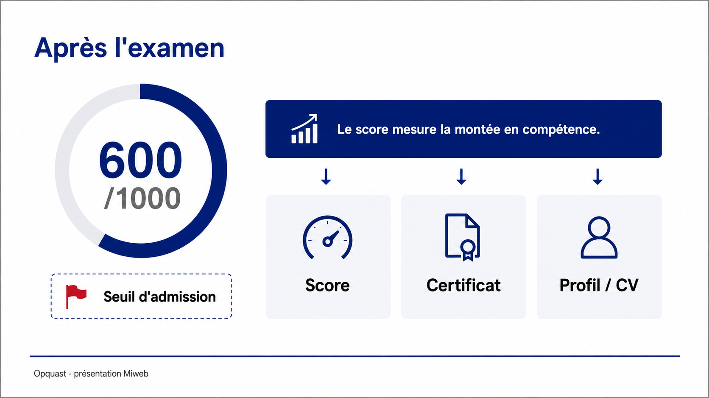

Origine : [2026-09-04-opquast-formation-miweb, slide 25](../assets/slides/slide-43.png). Correspondance vérifiée : fichier PNG identique.

### Prompt disponible

Consignes conservées dans le [storyboard source](origines/2026-09-04-opquast-formation-miweb/storyboard-pds.md), section de la slide 25 (ligne 319). L’[export des prompts](origines/2026-09-04-opquast-formation-miweb/imagegen-prompts-export.txt) ne permet pas de retrouver l’appel original exact.

```text
MASQUE COMMUN — extrait du storyboard

- Format : image finale 16:9, 1600 x 900 px.
- Fond : blanc.
- Structure : bleu nuit institutionnel `#001070`, panneaux gris froid `#F2F3F7`, rouge de contrôle `#E44850` uniquement pour un risque, une alerte ou un point à confirmer.
- Typographie visible : Marianne ; Arial seulement comme fallback explicite.
- Titre : haut gauche, casse de phrase, sans numéro visible.
- Footer : `Opquast - présentation Miweb`, discret en bas à droite.
- Formes : scènes concrètes, objets-systèmes, diagrammes plats, traits fins, flèches logiques, aucun faux logo ou emblème.
- Callout : phrase courte, stable en bas, bleu ou gris froid, jamais rouge.

CONTRAT DE LA SLIDE SOURCE 25 — Après l'examen

- Étape : résultat et usage du certificat.
- Idée principale : le seuil d'admission est 600 sur 1000 et le score mesure la montée en compétence.
- Idée observable : une jauge franchit `600/1000`, puis un certificat arrive par courriel et rejoint un profil professionnel.
- Forme visuelle : chaîne résultat -> usage.
- Visuel seul : le score ouvre un certificat partageable.
- Libellés : `600/1000`, `Score`, `Certificat`, `Profil`, `CV`.
- Phrase à retenir : `Le score mesure la maîtrise.`
- Ajout : clôt la certification.
- Prépare : le coût et l'outillage.
- Contraintes critiques : conserver le seuil 600/1000 ; ne pas transformer le score en classement d'excellence.
```

### Notes du présentateur

```text
Le seuil d'admission est de 600 points sur 1000.

Le certificat et le score arrivent par courriel. Ils peuvent être affichés sur un profil professionnel, un CV ou un portfolio.

Il n'est pas nécessaire de viser un score très élevé. L'objectif reste la montée en compétence, le score n'en est que la mesure.

Désamorcer l'angoisse de l'examen : 600 sur 1000 est un seuil de maîtrise, pas un score d'excellence.
```

Source : `ppt/notesSlides/notesSlide43.xml`, lié à la slide 43 dans le PPTX fourni.

---

<a id="slide-44"></a>

## Slide 44 — Ce que cela représente

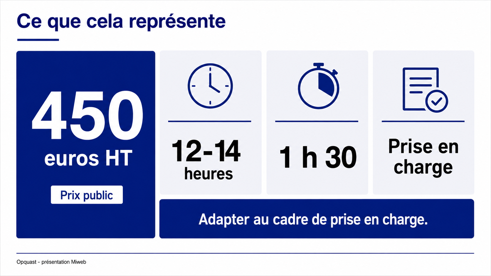

Origine : [2026-09-04-opquast-formation-miweb, slide 26](../assets/slides/slide-44.png). Correspondance vérifiée : fichier PNG identique.

### Prompt disponible

Consignes conservées dans le [storyboard source](origines/2026-09-04-opquast-formation-miweb/storyboard-pds.md), section de la slide 26 (ligne 331). L’[export des prompts](origines/2026-09-04-opquast-formation-miweb/imagegen-prompts-export.txt) ne permet pas de retrouver l’appel original exact.

```text
MASQUE COMMUN — extrait du storyboard

- Format : image finale 16:9, 1600 x 900 px.
- Fond : blanc.
- Structure : bleu nuit institutionnel `#001070`, panneaux gris froid `#F2F3F7`, rouge de contrôle `#E44850` uniquement pour un risque, une alerte ou un point à confirmer.
- Typographie visible : Marianne ; Arial seulement comme fallback explicite.
- Titre : haut gauche, casse de phrase, sans numéro visible.
- Footer : `Opquast - présentation Miweb`, discret en bas à droite.
- Formes : scènes concrètes, objets-systèmes, diagrammes plats, traits fins, flèches logiques, aucun faux logo ou emblème.
- Callout : phrase courte, stable en bas, bleu ou gris froid, jamais rouge.

CONTRAT DE LA SLIDE SOURCE 26 — Ce que cela représente

- Étape : investissement.
- Idée principale : la certification représente un coût financier et un temps de travail identifiables.
- Idée observable : une balance relie `450 euros HT`, `12-14 heures` et `1 h 30`.
- Forme visuelle : comparaison coût / temps.
- Visuel seul : l'engagement est mesurable.
- Libellés : `450 euros HT`, `12-14 heures`, `1 h 30`, `Prise en charge`.
- Phrase à retenir : `Le prix public peut varier selon la prise en charge.`
- Ajout : rend l'effort concret.
- Prépare : les outils disponibles.
- Contraintes critiques : afficher le prix comme prix public hors taxes ; ne pas inventer un tarif Miweb.
```

### Notes du présentateur

```text
Prix public de la certification : 450 euros hors taxes.

Investissement en temps : 12 à 14 heures de formation, puis 1 h 30 d'examen.
```

Source : `ppt/notesSlides/notesSlide44.xml`, lié à la slide 44 dans le PPTX fourni.
